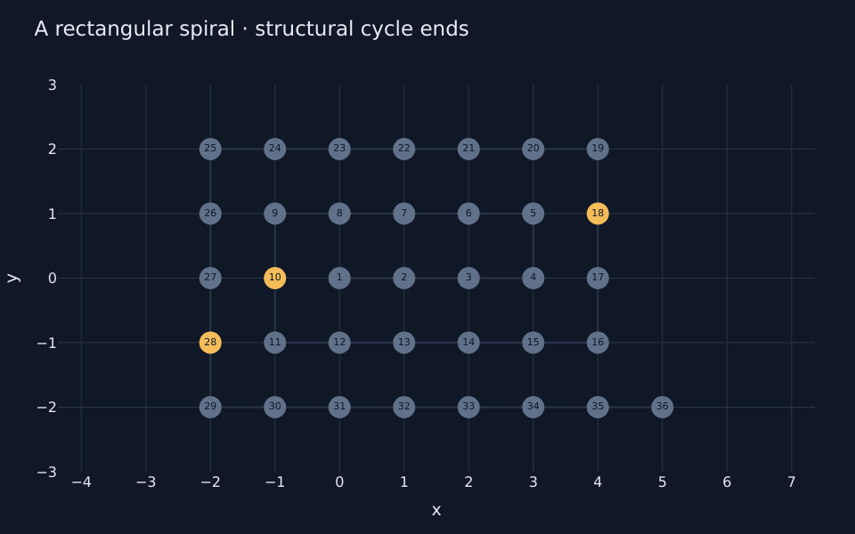
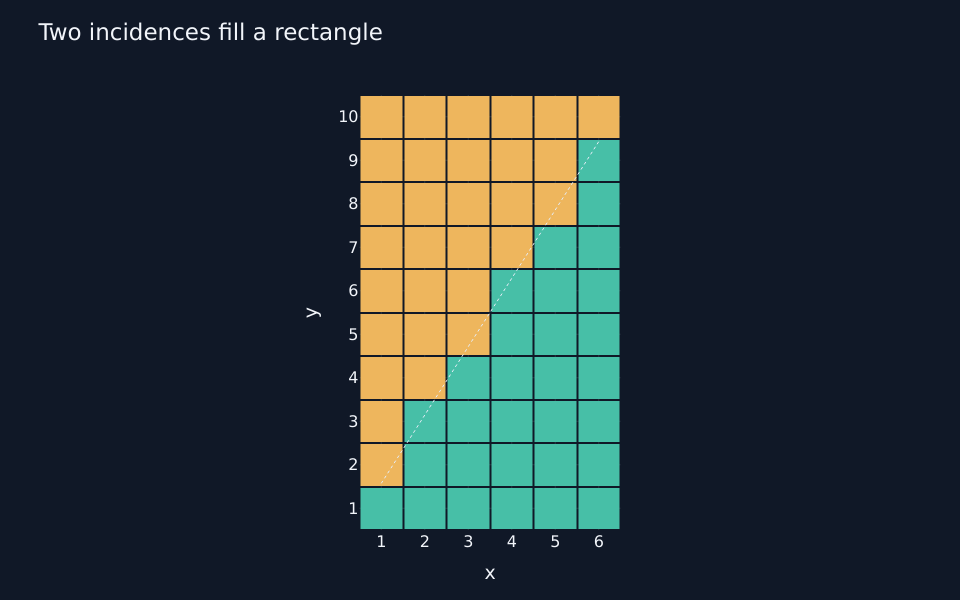
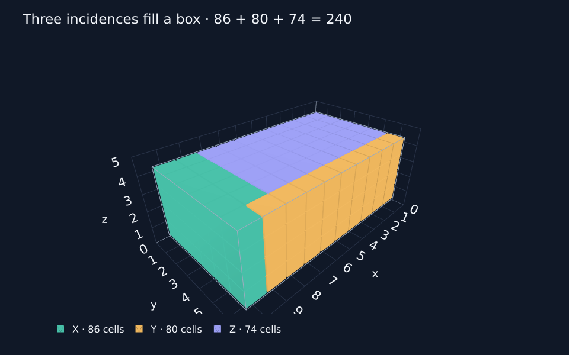
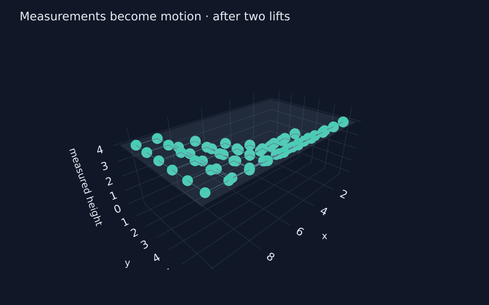
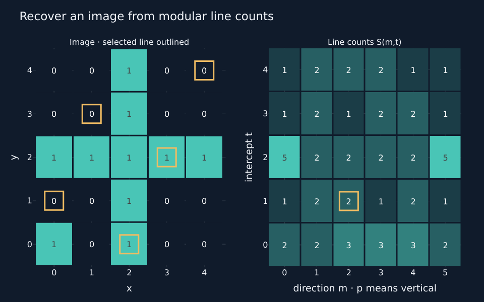
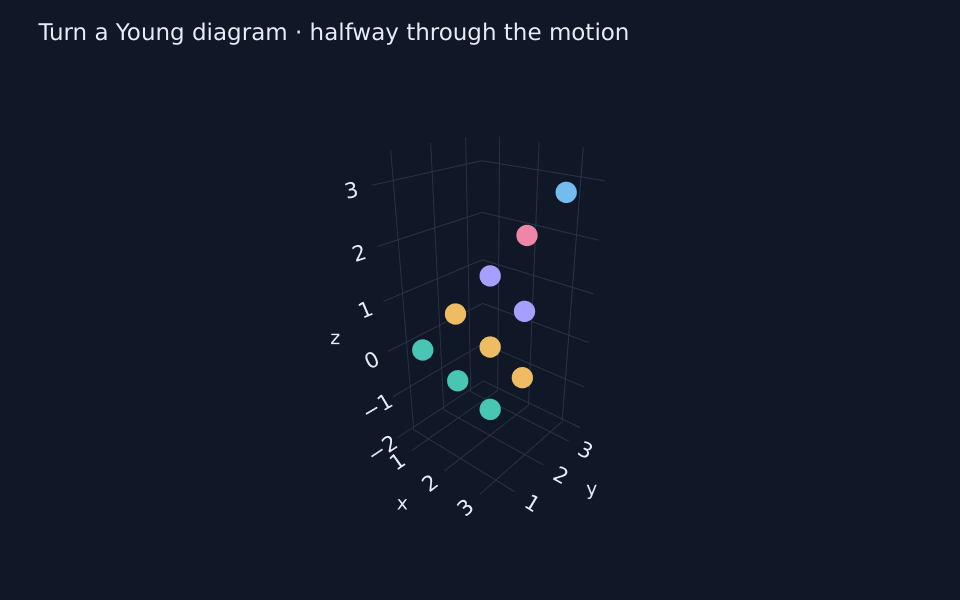
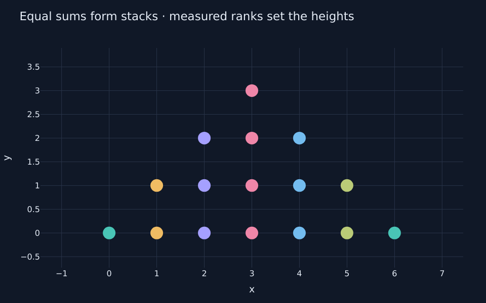
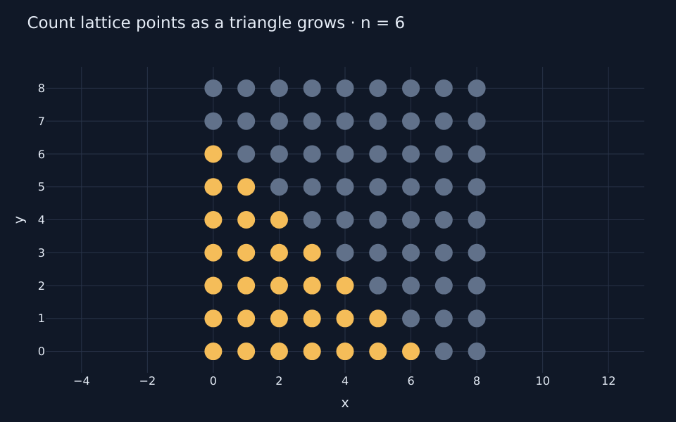
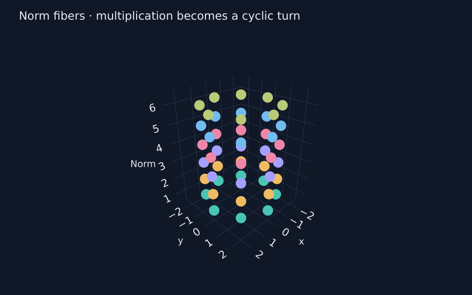
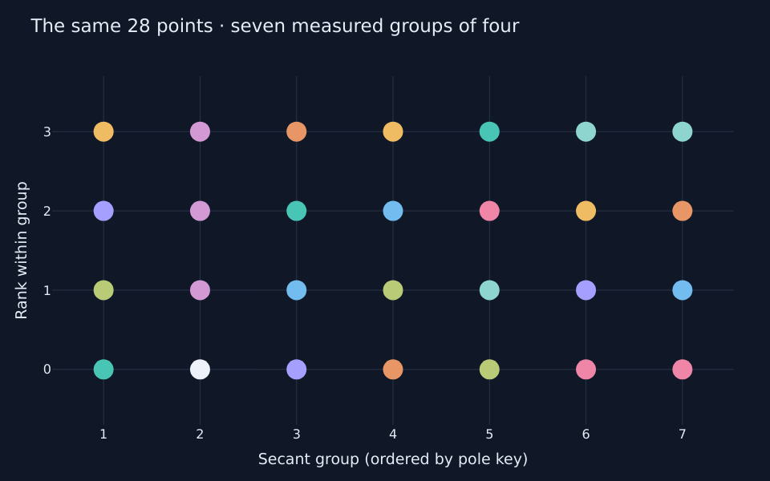

# Kaleion · 0.1.0

**Discover mathematics through motion.**

A working Python reference model for constructing integer arrangements, inspecting them through relations, deriving new arrangements from counts, and using those results to transform other arrangements. Definitions are symbolic; evaluation, mathematical state, provenance, and motion are separate.

This release starts with the primitive classes and operators. A [Jupyter walkthrough](notebooks/01_discovery_workbench.ipynb) provides an initial programmatic viewer with interactive Plotly plots, 3D rotation, scrubbable animations, and embedded MP4 videos. It also exports definitions, captured workspaces, and sampled motion as JSON. The existing single-HTML authoring prototype remains a separate application; an adapter between them has not been implemented.

Kaleion began as the renamed Icarus Python v0.1 baseline. The package version remains **0.1.0**; [CHANGELOG.md](CHANGELOG.md) records the baseline and subsequent unreleased refinements.

## A glimpse of the lessons

These images come from the working notebooks. Follow a preview to its construction, then run it in Jupyter to rotate, inspect, and replay the figures. GitHub displays the images; interactive Plotly controls work in Jupyter and the exported HTML.

<table>
<tr>
<td width="50%"><a href="notebooks/01_discovery_workbench.ipynb"><br><b>01 · Arrange, inspect, discover</b></a><br>Find structural patterns in a rectangular spiral.</td>
<td width="50%"><a href="notebooks/02_floor_sum_proof.ipynb"><br><b>02 · Two incidences fill a rectangle</b></a><br>See reciprocal floor sums as a disjoint cover.</td>
</tr>
<tr>
<td><a href="notebooks/03_three_incidence_box.ipynb"><br><b>03 · Three incidences fill a box</b></a><br>Extend the construction into three dimensions.</td>
<td><a href="notebooks/04_measured_motion.ipynb"><br><b>04 · Measurements become motion</b></a><br>Use incidence counts to move another arrangement.</td>
</tr>
<tr>
<td><a href="notebooks/05_finite_radon.ipynb"><br><b>05 · Recover an image from counts</b></a><br>Explore the finite Radon transform.</td>
<td><a href="notebooks/06_young_layers.ipynb"><br><b>06 · Turn a diagram; count its layers</b></a><br>Conjugate and pack a Young diagram using measurements.</td>
</tr>
<tr>
<td><a href="notebooks/07_additive_structure.ipynb"><br><b>07 · How many ways can a sum occur?</b></a><br>Make convolution and additive energy visible.</td>
<td><a href="notebooks/08_ehrhart_counts.ipynb"><br><b>08 · Count as a triangle grows</b></a><br>Discover polynomial and periodic counting laws.</td>
</tr>
<tr>
<td><a href="notebooks/09_norm_fibers.ipynb"><br><b>09 · A field changes its clothes</b></a><br>Rearrange a finite field so multiplication becomes a turn.</td>
<td><a href="notebooks/10_hermitian_partitions.ipynb"><br><b>10 · One curve, two ways to gather it</b></a><br>Let incidence measurements drive different partitions.</td>
</tr>
</table>

The images are static previews; selected motion frames show presentation states. [Preview sources and regeneration](docs/images/lessons/README.md).

## Run it

Requires Python 3.11 or newer and NumPy. Tested here with Python 3.12.14 and NumPy 2.3.5.

Clone the repository, or use the extracted `kaleion` source directory:

```sh
git clone https://github.com/virgil-barnard/Kaleion.git kaleion
cd kaleion
```

From that directory, create and activate a virtual environment (WSL, Linux, or macOS):

```sh
python3 -m venv .venv
source .venv/bin/activate
python3 -m pip install -e .
```

With the environment activated, run the example and tests:

```sh
python3 examples/discovery.py
python3 -m unittest discover -s tests -v
```

In each new terminal, run `source .venv/bin/activate` from the repository directory before working. Run `deactivate` when finished. If Ubuntu/WSL reports that virtual-environment creation is unavailable, install its venv support with `sudo apt install python3-venv`, then retry the setup.

The runtime dependency is NumPy; the tests use Python's standard library. No TensorFlow, PyTorch, browser, or network service is needed to execute the installed core.

## Explore in Jupyter

With the virtual environment above activated, install the optional notebook dependencies and register its kernel:

```sh
python3 -m pip install -e '.[notebooks]'
python3 -m ipykernel install --sys-prefix --name kaleion --display-name "Kaleion"
python3 -m jupyterlab notebooks/01_discovery_workbench.ipynb
```

Select the **Kaleion** kernel, then **Restart Kernel and Run All Cells**. The notebook starts with integer arrangements and lenses, derives counts with contributor provenance, drives cyclic shifts and 3D motion from those counts, explores structural spiral hits, and saves/reopens an investigation. Every construction is visible Python code that you can edit.

Then open [Two incidences fill a rectangle](notebooks/02_floor_sum_proof.ipynb). It connects the quotient-region counts to exact floor quotients, constructs the two reciprocal incidences, and animates their disjoint cover of a rectangle. Readable notation accompanies the plots, followed by a general proof and the overlap correction when the parameters are not coprime.

[Three incidences fill a box](notebooks/03_three_incidence_box.ipynb) extends the construction to three pairwise coprime integers. Rotate and isolate the stepped solids, scrub their rectangular cross-sections, and watch packing and undo. For `(11, 7, 5)`, their volumes are `86 + 80 + 74 = 240`. Explicit pair and triple intersections explain what changes when coprimality is relaxed.

[Three measurements lift a plane](notebooks/04_measured_motion.ipynb) counts the three solids along one common axis, then uses those derived arrangements as motion drivers for a separate plane. The coprime case ends flat; relaxing coprimality produces a bump whose contributing voxels can be inspected. The counts, exact discrepancy, source edit, and reversible motion retain their derivations.

[Can line counts recover an image?](notebooks/05_finite_radon.ipynb) constructs a finite Radon transform from modular incidences. Thirty line counts recover a 5×5 image through binding and summation. Animate the measured fields lifting another arrangement, inspect a pixel's contributors, and see why an altered measurement invalidates exact division.

[Turn a diagram; count its layers](notebooks/06_young_layers.ipynb) derives conjugate Young diagrams, turns the original cells through 3D, and packs them using measured prefix offsets. An ordering counterexample shows what layer counts forget.

[How many ways can a sum occur?](notebooks/07_additive_structure.ipynb) introduces convolution through a moving equal-sum lens. Measured ranks separate coincident pairs into stacks, and measured squares reveal additive energy. It includes an actual 2D MP4 alongside interactive Plotly views.

[Count lattice points as a triangle grows](notebooks/08_ehrhart_counts.ipynb) preserves parameter cases in a measured family, derives finite differences, and uses them to move independent probes. Interior counts explain reciprocity; a rational triangle introduces periodic polynomial formulas. Its video shows exact integer dilation cases.

[A field changes its clothes](notebooks/09_norm_fibers.ipynb) brings the norm-fiber and rotation experiments from [Finite-Hermitian-Geometry](https://github.com/virgil-barnard/Finite-Hermitian-Geometry) into Kaleion. Derived fiber counts set angular spacing, multiplication becomes a cyclic turn, and the fibers separate in 3D. Changing the generator and breaking the field assumption expose two different kinds of change.

[One curve, two ways to gather it](notebooks/10_hermitian_partitions.ipynb) constructs projective classes and a 28-point Hermitian curve over `F_9`. Explore its polar lenses, then use coverage counts and measured ranks to gather the same points into nine triples plus one point, or seven quadruples. Removing a line exposes uncovered points; captured motion reverses both partitions.

The [lesson guide](docs/lessons/README.md) provides educational notes for all ten notebooks. [Review notes](docs/lessons/REVIEW_NOTES.md) collect concrete findings about notation, provenance, ordering, and repeated construction recipes. [UI discovery notes](docs/lessons/UI_DISCOVERY_NOTES.md) identify declarative choices and module responsibilities. [Future lessons](docs/lessons/FUTURE_LESSONS.md) preserve plans for symmetry, error-correcting codes, further Hermitian investigations, and earlier extensions.

The [core refinement plan](docs/CORE_REFINEMENT_PLAN.md) examines the implementation through Parnas's information-hiding criterion. Parameter-bound incidence composition, independent field interpretation, one-pass contributors, and prepared motion are implemented. The core shares unchanged owned snapshot buffers and centralizes address and grouping rules. Explicit grouping, member order, coverage checks, and named placement now simplify lessons 07 and 10; prefix sums, case families, and broader explanation tools remain planned.

The `notebooks` dependency group includes JupyterLab, Plotly, and the small video-rendering dependencies. Plotly provides interactive figures; Pillow and imageio-ffmpeg render actual 1D/2D MP4 files from the same captured states and frames. Use Plotly's exported interactive HTML for 3D. No Chrome/Kaleido installation is needed. The core's default dependencies stay unchanged.

See [notebooks/README.md](notebooks/README.md) for VS Code/WSL usage, offline exports, and headless execution. Generated videos, HTML, and executed notebooks go under the ignored `build/notebooks/` directory; the committed notebooks have cleared outputs for readable reviews.

## Package and reference exports

The distribution and import name are both `kaleion`. For scripts written against the previous package, change `from icarus import ...` to `from kaleion import ...`; the old import namespace is not installed by this package. Install from this checkout using the command above.

The example writes three files to `examples/output/`:

- `construction-graph.json`: symbolic operation definitions and their dependencies.
- `workspace.json`: exact evaluated states, parameters, provenance, observations, undo history, and pending redo.
- `motion.json`: sampled forward and reversed motion tracks for a 3D example.

The included outputs were produced by the example. Running it again creates new source identities and capture timestamps, while preserving the mathematical results.

## Count an incidence, then arrange the counts

```python
from kaleion import Collection, F, param

a, b = param("a"), param("b")
region = Collection.grid(b, a, values=a * F.i + b * F.j).arrange(F.j, -F.i)
incidence = region.where(F.value >= a * b)
counts = incidence.count(by=F.i)
profile = counts.arrange(F.key, F.value)

result = profile.evaluate(a=11, b=7)
print(result.values.tolist())   # [0, 1, 3, 4, 6, 7, 9]
print(result.contributor_ids(0))  # () — the zero group remains present
print(len(result.contributor_ids(3)))  # 4
```

`by=F.i` retains the `i` key and reduces over the other indices. It does not mean “sum away i.” For a declared rectangular domain, retained-axis groups exist even if the reduced axis has length zero. Other grouping expressions use keys observed in the source, before filtering by the relation.

The result is a collection of integer cardinalities with contributors and a derivation. Giving those integers a placement does not change what was counted. They can immediately receive another lens and another reduction.

## Choose groups, order, coverage, and placement

These are separate declarations; a visible row is not required:

```python
points = Collection.grid(3, 4, values=F.i + F.j).annotate(point=F.key)
groups = points.group_by(F.value)
counts = groups.count()
ranks = groups.order_by(F.point).ranks(key=F.point)
height = ranks.bind(on=F.point, key=F.key)
stacks = points.arrange(x=F.value, y=height)

coverage = points.where(height == 0).group_by(F.value).coverage()
representatives = coverage.unique(value=F.point)
```

`ranks` counts strict predecessors within each group, with compact contributor
evidence. An order tie requires another declared order field. `coverage.unique`
requires exactly one match for every retained key; missing or repeated matches
fail explicitly, while `coverage.missing` and `coverage.overlaps` remain available
for inspection. Coverage uses the declared pre-mask group domain, including its
zero groups; it does not invent absent keys.

The [authoring guide](docs/AUTHORING.md) explains contexts, composite keys,
independent measurement-driven placement, and saved evidence. Run
`python3 examples/grouping_choices.py` for a complete small investigation,
including a failed assignment whose total count still looks correct.

## Compose incidences within their universe

`I.universe` names the collection or arrangement inspected by an incidence, including its local parameter cases. Complement, intersection, union, and selection also work after `with_params`:

```python
line = Collection.sequence(param("n")).arrange(F.value, 0)
even = line.where(F.value % 2 == 0).with_params(n=4)
below_n = line.where(F.value < param("n")).with_params(n=4)

print((even & below_n).select().evaluate().values.tolist())  # [2]
print((~even).select().evaluate().values.tolist())           # [1, 3]
print(even.universe.evaluate().values.tolist())              # [1, 2, 3, 4]
```

Each predicate keeps its original parameter scope. `with_params` binds the whole wrapped definition, including its source; a predicate added afterwards uses the surrounding evaluation parameters. Boolean combinations require the same declared universe and scope. Equal lengths or equal values alone do not establish that correspondence, and Kaleion does not infer equivalence between different binding expressions. `select()` preserves the selected identities and their placement, so its result can immediately be arranged, transformed, or measured again.

## One arrangement can drive different kinds of change

```python
from kaleion import Arrangement, Move, Values, vector

cloud = Arrangement.points(
    range(9),
    [(i % 3, i * i % 5, i % 2) for i in range(9)],
)
amount = profile.bind(on=F.value % 7, key=F.key, read=F.value)

moved = cloud | Move(vector(amount, 0, -amount))
relabeled = cloud | Values(F.value + amount)
```

There is no row requirement. `on` runs in the target's context; `key` and `read` run in the driver's context. A source key must identify exactly one item, and every requested target key must be present. A missing or ambiguous match fails explicitly. Reordering the driver's storage does not change a keyed binding.

To use the driver's geometry instead, declare it: `profile.bind(on=F.value % 7, read=F.y)`. To supply one constructor argument, select one item and call `.scalar()`:

```python
from kaleion import Construction

spiral_tool = Construction(Arrangement.spiral(36, initial=param("n")), ("n",))
seed_length = counts.where(F.key == 3).select().scalar()
driven_spiral = spiral_tool(n=seed_length)
print(driven_spiral.evaluate(a=11, b=7).values[-1])  # 36
```

Bindings, value changes, position changes, and constructor calls all remain in the saved operation graph.

## Undo restores state and reverses the recorded path

```python
from kaleion import Workspace, Motion

workspace = Workspace({"cloud": cloud, "counts": profile}, {"a": 11, "b": 7})
forward = workspace.set("cloud", moved, motion=Motion.arc(height=2, dimension=3))
backward = workspace.undo()

forward_frame = forward.frame("cloud", 0.75)
reverse_frame = backward.frame("cloud", 0.25)
# These frames have the same positions, opacity, and endpoint labels.

workspace.redo()
observation = workspace.capture("Displacement driven by the quotient-region counts.")
workspace.set_parameters(a=12)
workspace.restore(observation)
```

Undo does not need an inverse of the mathematical operation. A many-to-one reduction, a duplicated gather, or replacing every value with zero is reversible as an *edit* because history retains the previous state. A reversed transition samples its original motion at `1 - t`.

`Transition.start` and `.end` are the exact mathematical states. A `Frame` is presentation data: positions, opacity, occurrence correspondence, discrete before/after labels, and before/after incidence membership. Its `fraction` is progress along the original path, so it decreases during undo. A renderer can reverse a highlight or label transition without inventing fractional integer values or fractional truth.

Repeated gathers can yield coincident motion tracks. Reductions have contributor provenance, but no invented one-to-one movement. The default presentation fades unmatched items. Use exact snapshots at endpoints and for every subsequent calculation; never count animation tracks as mathematical items.

The journal covers setting/replacing/removing constructions, parameter edits, and restoring captures. New edits clear redo. Captures are retained separately; adding or editing notebook annotations is not currently an undoable command. Camera controls and an actual Undo button belong to the future UI.

## The primitive objects

| Object | Responsibility |
| --- | --- |
| `Expr` | Symbolic arithmetic, predicates, coordinates, and explicit bindings |
| `Collection` | Integer occurrences, keys, optional logical indices and attributes |
| `Arrangement` | A collection placed in one, two, or three spatial dimensions |
| `Lens` / `Incidence` | A reusable Boolean rule / its application to a specified universe |
| `Transform` | A composable description of value or placement change |
| `Construction` | A reusable definition with exposed parameter names |
| `Sweep` | Explicit cases for a parameter, with exact-case inspection and retention |
| `Snapshot` | An evaluated finite result, identities, lineage, and metadata |
| `Motion` / `Transition` / `Frame` | A path / captured endpoint states / presentation sample |
| `Workspace` / `Observation` | Definitions and history / a frozen captured investigation |

Logical dimension and spatial dimension are independent. A sequence can occupy 3D space; a three-axis grid can be projected into 2D. Moving a point does not silently change its logical indices or structural roles.

### Symbols and operators

| Syntax | Meaning |
| --- | --- |
| `F.value`, `F.index` | Integer label; current flat evaluation ordinal |
| `F.key` | Explicit item/group key; independent of placement |
| `F.i`, `F.j`, `F.k` | Declared grid axes; `F.s` is the sequence axis |
| `F.x`, `F.y`, `F.z` | Existing placement coordinates |
| `F.name`, `F["name"]` | A declared attribute or construction role |
| `param("n")` | Named parameter, bound at evaluation or in a construction call |
| `+ - * // % **`, comparisons | Symbolic operations; positive modulus gives least nonnegative residues |
| `/` | Floating division; use `//` for integer quotient |
| `(rule1) & (rule2)`, `\|`, `~` | Symbolic Boolean composition; parenthesize comparisons |
| `vector(x, y, z)` | Explicit vector expression |
| `choose(rule, yes, no)` | Elementwise selection; both branches are evaluated |
| `A \| Move(...)` | Apply a transform |
| `Values(...) >> Move(...)` | Compose transforms from left to right |

Use `&`, `|`, and `~` for expressions, not Python `and`, `or`, or `not`. Chained comparisons such as `0 < F.value < 5` are invalid; write `(0 < F.value) & (F.value < 5)`. A symbolic object has no Python truth value. `A == B` is deliberately undefined for constructions because equality needs a declared alignment and meaning. `A.same_definition(B)` checks definition identity only.

### Constructors and operations

| Purpose | API |
| --- | --- |
| Sequences and explicit data | `Collection.sequence(...)`, `.literal(...)` |
| Rectangular and partition domains | `Collection.grid(...)`, `.young(partition, values=...)` |
| Explicit and spiral placement | `Arrangement.points(...)`, `.spiral(...)` |
| Placement and displacement | `.arrange(...)`, `.place(...)`, `.move(vector(...))` |
| Labels and attributes | `.with_values(...)`, `.annotate(...)`, `.lookup(table, address=...)` |
| Inspection | `.where(rule)`, `Lens(rule)(A)`, `Lens(rule).window(lower, upper)(A)` |
| Selection and measurement | `.select()`, `.count(by=...)`, `.sum(by=..., value=...)`, incidence `.any(by=...)` |
| Address maps | `.gather(addresses, axis=...)`, `.permute(...)`, `.order_by(...)` |
| Cyclic shift | Arrangement `.roll(axis=..., shift=...)` |
| Multiplicity and extension | `.tile(times, axis=...)`, `.concat(other, axis=...)`, `.pad(...)` |
| Bindings | `.bind(on=..., key=..., read=...)`, singleton `.scalar()` |

`Gather`, `Tile`, and `Concat` produce a collection; declare its new placement explicitly. `Permute` checks bijectivity. Gather indices are nonnegative integer addresses in bounds. Roll requires a declared rectangular axis and one cyclic shift per fiber; arbitrary per-cell address rules belong in Gather. Positive Roll uses source index `(destination - shift) % length`.

`pad` extends the flattened sequence with actual integer values. Padding extra attributes requires declared fill values. To add columns to a matrix, concatenate a compatible zero-valued grid along the chosen axis. Concatenation requires matching attribute names; it does not invent meanings for missing attributes. Repeated keys after Gather/Tile/Concat must be disambiguated or reduced before using them as a driver.

Young constructors enforce a nonincreasing partition and expose cell indices. The core does not automatically assert that a filling is a standard or semistandard tableau.

## Structural discovery and time

```python
from kaleion import Sweep

spiral = Arrangement.spiral(36, initial=param("n"))
endpoints = spiral.where(F.cycle_end)
cases = Sweep(endpoints, "n", range(1, 18))
seen = cases.retain(16)
print(sorted(item["value"] for item in seen))
```

This spiral begins at 1, with no zero hole. The first `n` items form its initial row. Each complete growth cycle adds an outer row and column on alternating sides. The lens reads the emitted `cycle_end` role, not a primality predicate. Through 36, these 17 cases retain exactly the 24 composites. The test suite independently validates that finite example.

`Sweep.at(index)` evaluates an exact mathematical case. `retain(index)` includes every case from zero through that index, including cases skipped while scrubbing. A backward query uses the smaller interval. `Sweep.transition(start, end)` supplies motion between captured cases; interpolated geometry does not define additional mathematical cases.

The available spiral and Young constructors are reference constructions. Arbitrary symbolic coordinates are supported, but there is no general user-authored recursive recipe interpreter yet.

## Provenance and persistence

An operation graph records inputs, parameters, expressions, and operation versions. Evaluation records add case identity, status, finite extent, and declared primitive families. These families explain the lowering strategy; they are not instrumentation of every NumPy call or a derivative tape.

Each result carries occurrence IDs and source identities separately. A reduction records its universe, grouping keys, populations, contributors, and finite formula. Placement preserves its measurement interpretation. Changing the measured values retains the derivation in the graph but removes the active cardinality claim from that result.

Snapshots copy incoming data and expose read-only arrays. Derived placements reuse
unchanged integer contents and attributes within an evaluation. This keeps long
construction chains smaller while preserving captured state. For editable NumPy
data, use an explicit copy such as `snapshot.values.copy()`. The ownership rules
and the distinction from caching across workspace edits are in [DESIGN.md](DESIGN.md).

```python
from pathlib import Path

Path("investigation.json").write_text(workspace.to_json())
restored = Workspace.from_json(Path("investigation.json").read_text())
```

Saved results and history reopen without rerunning their constructions. The format is versioned JSON with data-only expressions. The Python format is distinct from the browser prototype's format; no automatic migration is included. Provenance explains a finite result; it is not a proof certificate.

New Python exports identify themselves as `kaleion-python`, schema 1. `Workspace.from_json(...)` also accepts the previous `icarus-python`, schema 1, preserving captured results, identities, undo/redo, and observations. Saving an imported Python workspace writes the Kaleion name. This compatibility does not apply to the separate HTML prototype's format.

## Current implementation boundaries

- NumPy CPU reference evaluator; exact Python integers up to a 4096-bit budget. Floating-point coordinates and motion use `float64` and have ordinary rounding limits.
- Default evaluation limit: 10,000 occurrences per result and 2,000 operation nodes. Larger configured finite budgets are possible. Evaluation is synchronous; there is no worker cancellation, chunked infinite scrolling, or incremental cross-case cache.
- One failed dependency blocks its dependents; independent roots still evaluate. This is computation-level isolation within one process.
- No GPU adapter, automatic differentiation, theorem prover, polynomial interpolation engine, or migration of the original Icarus repository in this package.
- Custom paths, straight motion, and arcs are implemented and viewable in the optional Plotly adapter. A special cyclic wrap/cut-and-reassemble presentation and a full authoring GUI remain future work.

See [DESIGN.md](DESIGN.md) for contracts and tensor lowering, [VALIDATION.md](VALIDATION.md) for checks, and [KALEION_DISCOVERY_ARCHITECTURE.md](KALEION_DISCOVERY_ARCHITECTURE.md) for the broader architecture and remaining work.

## Contributing

Develop changes on a feature branch and submit a pull request. [CONTRIBUTING.md](CONTRIBUTING.md) describes the validation commands, design boundaries, and contribution attribution.
