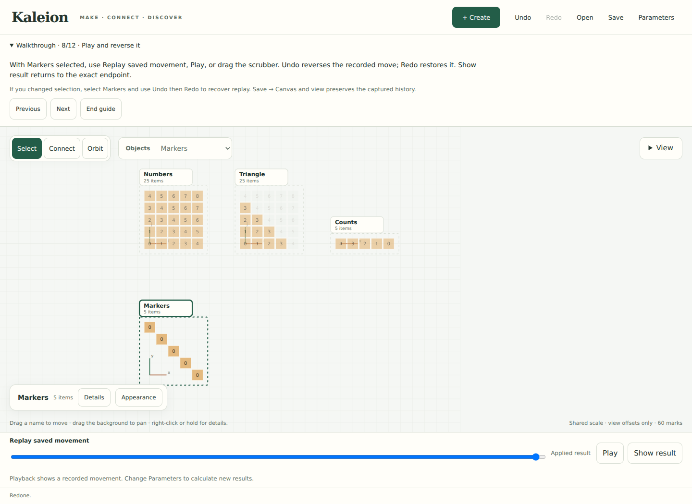

# From a count to a movement

Start the studio from an activated environment:

```sh
python3 -m examples.studio
```

Choose **Open → Start walkthrough**. The collapsible strip gives one step at a
time while you use the ordinary controls. Next/Previous only turn the instructions;
they do not perform actions, check your progress, or replace your work. Collapse
the strip when you want more canvas space. This page explains the same investigation
and its extensions.



**Open** also offers ten worked canvases and a blank one. Choose a title to read
its description, then **Load example** to replace the current workspace. Save first
if you want to keep it. **Choose a file** opens your own saved work. Starting the
walkthrough by itself does not clear anything.

## 1 · Construct a triangle

1. **Open → Blank canvas → Load example**.
2. **Parameters → Declare parameter**: name `n`, value `4`. **Preview results**,
   then **Keep results**.
3. **Create → Grid**: name `Numbers`, both sizes `n + 1`. Choose **Values from a
   formula**, enter `i + j`, then **Create**. The indices on each axis run from
   zero through four; the 25 numeric labels are sums of indices.
4. Select **Numbers → Details → Relation**, name the result `Triangle`.
   **Customize the formula → Write a rule**: `value < n`.
   **Preview**, then **Apply**. Ten cells match; the other fifteen still belong
   to the domain. You can select objects by name or through the Objects list.
5. **Triangle → Details → Sum / count**: name `Counts`, choose **Count matches**,
   total along `j` only and retain `i`. **Preview**, then **Apply**.

The new object's values are **4, 3, 2, 1, 0**. Rotating the view does not change
what `i` and `j` mean. We count the fibers with a fixed `i`, regardless of which
direction those fibers appear to run on the screen. The final zero is a measured
empty fiber, not a missing occurrence.

Beside the picture, the construction can be read as

\[
D_n=\{0,\ldots,n\}^2,\qquad
T_n=\{(i,j)\in D_n:i+j<n\},\qquad
C_n(i)=\#\{j:(i,j)\in T_n\}.
\]

This is a human-written explanation of the controls, not automatically extracted
notation. The current **How this is made** inspector shows the actual definitions
and their captured inputs.

## 2 · Make the measurement move another object

1. **Create → Vector**: name `Markers`, size `n + 1`, **Values from a formula**
   `0`, then **Create**. These are five distinct occurrences whose labels are zero.
2. **Counts → Details → Combine**: choose `Markers` as Destination, then
   **Drive a transformation**. Keep **Coordinates**; the source read initially
   supplies y. The same instrument can also drive displacement or cyclic shifts.
3. Review `x = i` and the y-coordinate's **Keyed read**. Keep source and target
   keys as `key`, and supplied value as `value`. Both constructions use keys
   `0,...,n`, so each marker has exactly one measured driver. **Preview**, then
   **Apply**.

The marker at index `i` now has position `(i,C_n(i))`. Its label remains zero.
Applying coordinates shows **Placement**; it records a transition between the
captured endpoints. This is how to create mathematical motion. Dragging an
object's name only organizes its view on the board.

Use **Play** or the **Replay saved movement** scrubber. **Undo** returns the same
occurrences to the line; **Redo** restores their heights. **Show result** exits
presentation and shows the captured endpoint. If replay disappeared after changing
selection, select Markers and use Undo then Redo immediately after this move.
History is workspace-wide: after further edits, Undo reverses the most recent
edit, not necessarily the selected object's movement.

For a different shape, **Details → Arrange / move** offers one,
two or three coordinates. Each can read a field, expression or uniquely keyed
measurement. You can explicitly choose **Appearance → Logical axes** again;
ordinary browsing and replay do not change that choice. Coordinate Preview is
temporary, and Cancel restores the earlier appearance as well as the mathematics.

## 3 · Follow a point back to its evidence

Tap the marker at height two. If it is hard to reach, **Appearance → Choose an
item**, then choose `2 · value 0`. Follow its **keyed read**, then **View measurement
and contributors**. The measurement has two contributors: `(i,j)=(2,0),(2,1)`.
They have labels two and three, but each contributes **one** to this count.

Repeat with the zero-height marker. Its measured group is present and its
contributor set is empty. The receipt distinguishes its label zero, its height
zero, its key, and the empty set that explains the height. No point is fabricated
to illustrate the empty set.

The Construction inspector, contributor links, and comparison witnesses read
captured definitions/results. Moving a camera, selecting a contributor or scrubbing
replay does not recalculate the construction.

## 4 · Compare an independent construction

Create a Vector named `Formula`, size `n + 1`, with value formula `n - i`.
Select **Counts → Details → More tools → Compare exact fields**:

| Role | Object | Field to compare | Key fields, in order |
| --- | --- | --- | --- |
| Left | Counts (selected) | `value` | `i` |
| Right | Formula | `value` | `i` |
| Expected domain | Formula | No value comparison | `i` |

**Compare captured values** reports five equal keys. The independently declared
domain ensures a missing zero would be reported as missing. Comparing the totals
alone could conceal an incorrect distribution. Here both values and domain of
Formula are constructed independently of Counts.

Change **Parameters → n** to `6`, preview and keep the results, then reopen the
comparison and check again. Expect seven equal keys. At `n = 0`, one zero remains
on each side; the relation has no matches. Parameter changes are fresh exact
calculations, separate from interpolated playback. Very large cases remain subject
to the studio's finite evaluation budget.

The general statement suggested by these cases is

\[
\forall n\in\mathbb Z_{\ge0},\quad
\forall i\in\{0,\ldots,n\},\qquad C_n(i)=n-i.
\]

For a fixed `i`, the allowed integers are `0,...,n-i-1`, an empty set when `i=n`.
This supplies a mathematical argument for the statement. The software's finite
comparison did not supply that argument or prove it for every `n`.

**Save → Canvas and view** preserves applied definitions, exact captures,
contributors, history, object offsets, selected object and camera. Reopen it through
**Open → Choose a file**. An unfinished draft, walkthrough progress and the current
comparison report are tab-local and are not saved as a conjecture.

## 5 · Extend the same triangle

The introductory path exercises the main create–relate–measure–place–inspect–compare
loop. The following extensions expose the remaining shared controls without
pretending one walkthrough covers all eleven notebooks. Load **Pack a triangle**
to inspect completed ranks/prefixes and reverse its packing movement.

| Intent | Ordinary controls and declaration | Expected observation for `n=4` |
| --- | --- | --- |
| Change the measure | Triangle → Sum / count → Sum weights, weight `value`, total `j`, retain `i` | Weighted totals `[6,6,5,3,0]`; contributor values now supply weights |
| Make one total | Triangle → Sum / count → Count matches, total both axes | Area 10, explained by ten matching cells |
| Inspect a fiber | Triangle → More tools → Browse groups, key `i` | Group `i=4` exists and has no matches; a group can become its own relation |
| Keep the pieces | Triangle → More tools → Keep matches | Ten selected occurrences; future grouping of this new domain no longer includes the empty fiber |
| Order each group | Selected pieces → More tools → Measure with keys and order → rank; group `i`, order `j`, unique item key `key` | Ranks start at zero in each fiber; equal order keys must be resolved |
| Accumulate group widths | Counts → Measure with keys and order → Prefix sum; no group keys, order `i`, unique item key `i`, weight `value` | Offsets `[0,4,7,9,10]`; offset 7 reads earlier counts 4 and 3 |
| Pack with two measurements | Selected pieces → Arrange / move; x = a keyed read of Offsets (`i` to `i`) plus a keyed read of Ranks (`key` to `key`), y = 0 | Ten distinct locations `0,...,9`; two composed measurements determine placement |
| Check correspondence | Counts → More tools → Check coverage; match source `i` to Formula's `i` | Exactly one measured item per expected key, including the zero; **Use unique matches** can attach its value as a named field on a copy of Formula |
| Make a named quantity | Numbers → More tools → Add a named field; name `total`, formula terms `i + j` | Field and contents stay distinct; a new relation may read `total` |
| Reuse a rule | Triangle → Reuse rule; choose another suitable grid and map `value` to its chosen field | An explicit copied predicate; the reuse panel states which parameter values are captured |
| Enumerate a relation's domain | Make two small vectors; Combine → Make every pair; choose factor role names and copied fields | Distinct occurrences survive repeated labels; the Equal sums example develops this construction |

In the coordinate editor, use **Operation +** to combine the two **Keyed read**
terms. These specialist controls are more verbose than the simple height shortcut;
that is a concrete remaining authoring problem, not a reason to hide key alignment.
The saved packing example records a curved path through Python's Motion recipe;
the current UI creates a default transition and does not yet edit curve controls.

## 6 · Three measurements lift a plane

Load **Three measurements lift a plane**. It uses `(a,b,c)=(5,4,3)` and a small
24-cell box. Select **Lifted plane**, Undo three times, then Redo three times.
Each stage adds the measured height of one region. Use **View → 3D** and
**View → Selected**; Appearance offers Points and slices if cells feel expensive
to orbit. These are viewing alternatives, not a measured performance fix.

All three regions are counted along **the same k axis**, retaining `(i,j)`.
The independent footprint has 12 points at height zero. Their common key domain
allows three successive reads; the endpoint is flat at `c-1 = 2`. Compare
**Lifted plane.value** with **Expected height.value**, keys `(i,j)`, expected
domain **Footprint** with keys `(i,j)`. All twelve values agree.

Change to `(6,4,5)` and compare again. The logical column `(i,j)=(2,1)`, displayed
at `(u,v)=(3,2)`, reaches six rather than four. Follow its measurements to see
which source cells were counted twice. The loaded recipe pairs value changes
with placement so comparison can read an exact integer field; geometry alone
is not the compared mathematical object. Existing input definitions stay fixed
when you make a new child; shared parameters recalculate those definitions.

## 7 · A box of ones, and a failed assumption

Load **A box of ones**. Here the three regions count singleton fibers with all
three keys retained, rather than reducing along one axis. Their counts are zero
or one. **Cell owners** adds the three counts by `(i,j,k)`.
**One per cell** is independently derived by counting each singleton of the full
Box. Compare their `value` fields, key fields `(i,j,k)` in that order on both
sides, and **Box** as expected domain with those same keys. Expect **24 equal**.
Counted volume and Box volume both have value 24.

The all-ones object is the **per-cell ownership count**. Its sum is the volume.
For positive integers `a,b,c > 1`, write

\[
D=\{1,\ldots,a-1\}\times\{1,\ldots,b-1\}\times\{1,\ldots,c-1\},
\]
\[
X=\{(u,v,w)\in D:av\le bu\text{ and }aw\le cu\},
\]

and define Y and Z by making `v/b` and `w/c` respectively a largest normalized
coordinate. The pointwise statement is

\[
\gcd(a,b)=\gcd(a,c)=\gcd(b,c)=1
\quad\Longrightarrow\quad
\mathbf1_X+\mathbf1_Y+\mathbf1_Z=\mathbf1_D\text{ on }D.
\]

Every point has a largest normalized coordinate. If, for example, `u/a=v/b`,
then `bu=av`; coprimality implies `a` divides `u`, impossible for `1≤u<a`.
The other pairs have the same argument. Thus the largest coordinate is unique,
so every point is counted exactly once. Summing the pointwise statement by columns
explains the flat plane. Summing by each region's own sections gives

\[
\begin{aligned}
&\sum_{u=1}^{a-1}\left\lfloor\frac{bu}{a}\right\rfloor
                       \left\lfloor\frac{cu}{a}\right\rfloor
+\sum_{v=1}^{b-1}\left\lfloor\frac{av}{b}\right\rfloor
                       \left\lfloor\frac{cv}{b}\right\rfloor\\
&\qquad+\sum_{w=1}^{c-1}\left\lfloor\frac{aw}{c}\right\rfloor
                           \left\lfloor\frac{bw}{c}\right\rfloor
=(a-1)(b-1)(c-1).
\end{aligned}
\]

Now load **When two regions claim a cell** and repeat the same comparison. Although
`gcd(6,4,5)=1`, the first two dimensions share a factor. There are **58 equal
keys and two different keys**. Logical keys `(2,1,0)` and `(2,1,1)` have two
owners each: X and Y share physical points `(3,2,1)` and `(3,2,2)`. Each residual
is one; counted volume is 62 while box volume is 60. Pairwise coprimality is
sufficient for the general identity; a joint gcd of one is not a substitute.

This counterexample is especially useful preparation for proof assistance:
generalizing constants without generalizing the right assumptions gives a false
statement. The formulas and arguments above are written for this tutorial. They
are not a generated theorem or a checked prover result.

## Boundaries and next experiment

The worked captures use the existing graph, measurements, scoped inspection,
comparison and recorded history. `examples/save_canvases.py` owns their mathematical
recipes. `studio/catalog.py` owns titles and trusted file choices. `learning.js`
owns instructional navigation; it never issues a construction command. Existing
import owns validation and replacement. No lesson-specific backend command or new
saved format is introduced.

A future observation should name both derived objects, compared fields, key
correspondence and domain; pin supporting and failing cases; expose exactly which
constants become variables and which remain fixed; record assumptions; then
translate supported definitions to a proof assistant. The proof assistant must
return a checked theorem under those assumptions or a clearly unresolved goal.
It must not promote finite agreement to a universal proof. Comparison reports are
currently transient; recording such an observation is a useful next increment.

The immediate human test is simpler: build the moving counts without loading the
answer, explain the zero, then transfer that motion method to a new relation.
Watch where the author first needs a hint. Test the compact 3D case on an actual
touch device before claiming orbit performance or novice accessibility.

## Reproduce the checks

```sh
python3 -m unittest discover -s tests -p test_saved_canvases.py -v
node docs/studies/check-canvas-tutorial.cjs
```

The browser gate uses the existing optional Playwright/Chromium installation
and environment variables described in the
[studio validation guide](CONSTRUCTION_STUDIO.md#validation-and-reproduction).
It constructs the tutorial through the public controls, checks saved motion and
appearance, loads every example, follows contributors, compares the 3D cases,
varies parameters, saves/reopens, and checks keyboard and emulated touch. The
read-only API is an oracle for captured results, not a shortcut for authoring.

Recorded September 24, 2026: **231 tests ran; 227 passed and four optional Plotly
tests skipped** because Plotly is absent from this host. The discovery example,
offline scene/document check, and tutorial, continuous-canvas and relation-notation
browser gates passed with Chromium 153.0.8010.0. Desktop and 360 px screenshots
were inspected. No notebook or video exporter changed, so no new notebook/video
validation is claimed. Physical-device, novice and screen-reader trials remain open.
