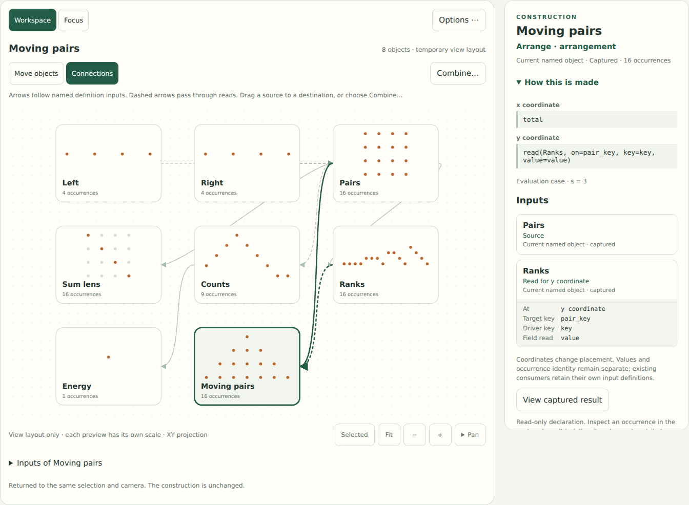

# See how an object was constructed

Selecting a workspace object now opens **How this is made** beside its picture.
It shows the actual constructor, readable arguments, ordered inputs, evaluation
case, and result status. This is the first implementation step in the
[unified canvas design](UNIFIED_CANVAS_DESIGN.md), responding to the difficulty
of understanding a saved object before editing it.

Construction and occurrence evidence answer different questions. **Moving pairs**
declares a y coordinate read from **Ranks**, aligned by `pair_key` to `key`.
Inspecting one occurrence then explains the particular rank it read and the
earlier pairs counted to produce it. Both paths use the applied captured state.



## Try it in a saved canvas

Run `python3 -m examples.studio` in the existing virtual environment and open
`examples/canvases/07_equal_sums.json` through **Open**.

1. Select **Moving pairs**. Read its x/y coordinates in **How this is made**.
   Under **Ranks**, the target key, driver key, and field read are shown separately.
2. Select the **Ranks** input. Its construction shows the group keys, strict
   member order, and unique item keys. The corresponding workspace object is
   selected too. Follow another input to continue toward a source.
3. Choose **Back to Moving pairs**. Selection, camera, previous controls, and
   input-button focus return. Browsing does not enter mathematical history.
4. Choose **View captured result**, select an occurrence, and choose
   **Inspect selected occurrence**. The existing receipts explain its fields,
   contributors, weights, and declared reads. The construction header stays nearby.
5. Open the Young canvas and select **Offsets**. Its prefix construction makes
   the contribution weight and strict order visible. Try the same inspection
   path on **Backprojection** in the Radon canvas.

On a narrow screen, **Construction and evidence** moves to the inspector and
**Canvas** returns to the picture. **How this is made** can collapse; opening
authoring tools or occurrence evidence collapses it automatically. A draft is
parked when following inputs and can be resumed on its original target.

## What the inputs mean

| Label | Meaning and navigation |
| --- | --- |
| Current named object | The exact definition is still a named root in the surrounding case. Following it selects that object. |
| Earlier or unnamed input | The definition is not a current named root. Follow its declaration and, when retained, its captured result. No current replacement is substituted. |
| Local case input | This definition belongs to a declared local parameter case. Inspect its local bindings and captured result, even when the bindings happen to equal the global values. |
| Not captured / result capture unavailable | The declaration remains readable, but View captured result is disabled. Inspection never recomputes missing evidence. |
| Evaluation failed | Show the recorded error and actual inputs. An uncaptured local input cannot fall back to a successful global namesake. Independent objects remain usable. |

A case's definition input enters its captured local trace; expressions used to
calculate its bindings refer to the surrounding case. The inspector preserves
that boundary through nested cases. Empty captures are available results with
no selectable occurrences, not failed or missing captures.

Products show their stored expansion into Grid, counts, and reads. The inspector
does not invent a Product opcode or reconstruct an editable recipe from a picture.
Unknown constructors retain their attributes, inputs, and an exact-operation
view. Exact integer syntax travels as text, including integers larger than
JavaScript's safe range. Long previews and canonical excerpts are explicitly
bounded; ordinary **Save** retains the complete declaration.

## Implementation boundary

`examples/studio/construction.py` describes definitions and captured trace paths.
Root descriptions travel with the existing state response, so selecting or
moving a named object requires no query. Following a deeper input uses the
revision-checked `/api/construction` read query. Neither route executes expressions,
evaluates a graph, edits a recipe, or changes saved history.

`construction.js` owns the temporary inspection stack, cached descriptions,
focus, and restoration. `studio.js` connects this to the existing selection and
draft contexts. `evidence.js` now also presents a single captured result using
its existing occurrence and camera controls. Stale replies cannot replace a
newer object selection. Core operations, public Python signatures, dependencies,
and schema-1 workspace meaning are unchanged.

## Validation and remaining questions

The required Python suite passes **203 tests** and the discovery example retains
its expected outputs. Eight new construction tests inspect all four saved
canvases with evaluator execution disabled and exercise earlier drivers,
nested/failed local cases, outer-scope binding reads, tuple keys, signed weights,
unknown constructors, large integers, missing captures, and stale paths.

```sh
python3 -m unittest discover -s tests -p test_studio_construction.py -v
python3 -m unittest discover -s tests -v
python3 examples/discovery.py --out build/example-output
node docs/studies/check-construction-inspector.cjs
```

The optional browser gate uses the existing Playwright/Chromium environment
options documented in [the studio guide](CONSTRUCTION_STUDIO.md#validation-and-reproduction).
It checks real controls on all four saved canvases, restored selection/cameras
and focus, occurrence evidence, draft continuity, failed/empty/earlier/local
captures, exact integers, delayed replies, unchanged export, and absence of
evaluation/history requests. Desktop, dark, and 360/320-pixel layouts were
inspected in Chromium 153. The full studio, spatial-workspace, and saved-canvas
browser gates also pass. The phone group-tap check now uses the visible Canvas
jump and verifies the tap is not covered by the sticky navigation.

This addresses the missing construction information in UI-study finding A14;
whether people understand it without guidance still needs observation. The sheet
is long, especially on phones. Physical touch, Safari, screen readers, and novice
transfer remain untested. The subsequent [shared scene](SHARED_SCENE.md) replaces
independently scaled previews with common cell/point/3D geometry while retaining
this inspector. Visible captured tracks, reusable rules, recurrence, and editable
live connections remain separate work.
