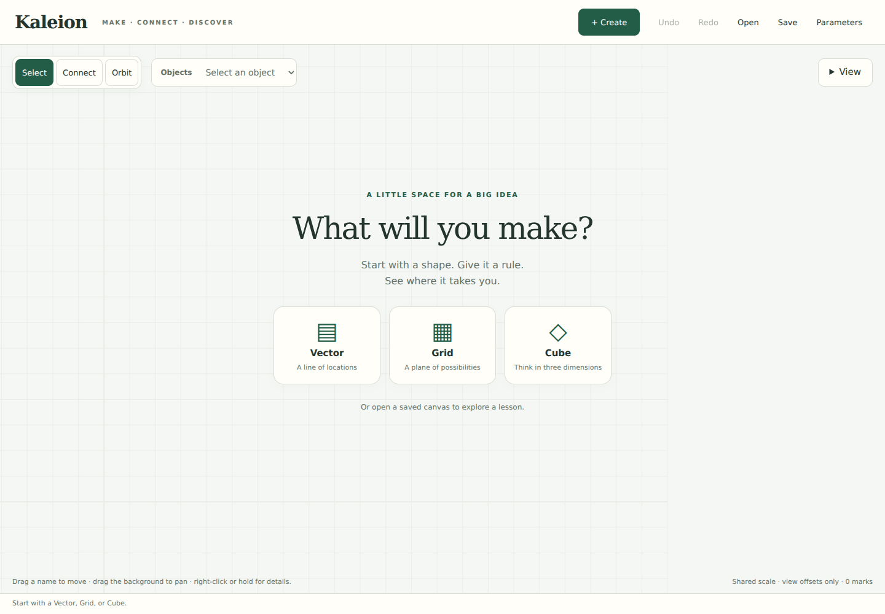
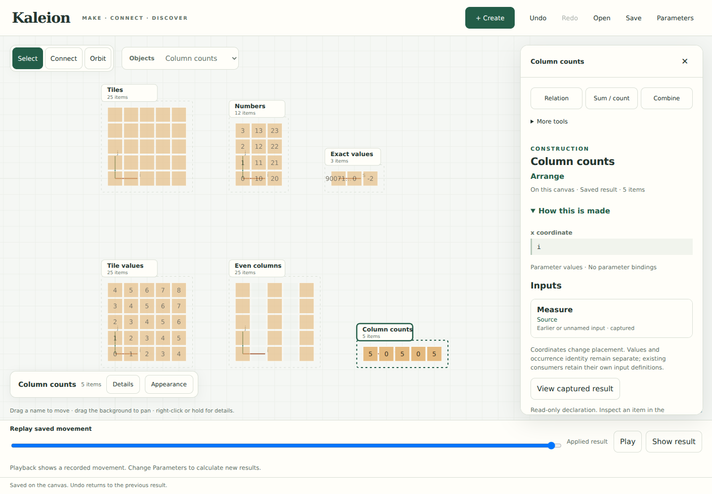

# One canvas, fewer decisions

September 23, 2026 · Interaction reset within PR #33





The maintainer found the studio crowded and disorienting. Empty-space context
menus offered unrelated object actions, unfamiliar vocabulary preceded the task,
and Focus replaced the scene just when the author needed to understand an object
in context. These are failures of the interaction model. More shortcuts did not
resolve them. This increment replaces that model's shell and source-creation path.

## Try the new loop

Run `python3 -m examples.studio` and open the printed local address.

1. Choose **Grid**. Keep **Tuples only**, then **Create**. There are locations
   `(i, j)` with indices starting at zero and no numeric contents.
2. Create another Grid with **Values from a formula**, such as `10*i + j`.
   Sizes and names are independent of the value formula. Size zero is allowed.
3. Select either object. **Details**, right-click, long-hold, Enter, or Shift-F10
   opens the same inspector; closing it leaves the camera where it was.
4. Try **Relation**, choose one input `i` and Even numbers, then Preview / Apply.
   **Sum / count** turns matching columns into a new, reusable result. All sources
   remain on the board. **More tools → Set values from a formula** assigns contents
   to a new child of a tuple object without erasing the original.
5. Open a saved lesson canvas. Follow an input in **How this is made**, then Back.
   Select a cell to follow its value and contributors. Saved evidence opens in the
   drawer while the working scene stays visible.

A Vector also offers **Values I type**. Formulas accept integer constants, index
names, declared parameters, `+ - * // %`, and parentheses. Decimal text reaches
Python without JavaScript rounding. Formula text is parsed into the ordinary
expression tree; it is not evaluated as Python. Calls, attributes, subscripts,
true division, and exponentiation are outside this short notation. Detailed
expression controls still handle keyed reads and specialist constructions.
**Index names and sizes** discloses naming and parameterized lengths such as
`n + 1`. Ambiguous field/parameter names fail rather than guess their meaning.
That check includes the built-in flat `index` in value formulas. The same name can
still be a parameter in a size formula, where item fields do not exist.

## Command ownership

| Place | Its responsibility | Removed from that place |
| --- | --- | --- |
| Header | Create, history, files, parameter values | The permanent case summary and separate source shortcut |
| Background menu | Vector, Grid, Cube | Actions inherited from the last selection |
| Selected object strip | Name, Details, Appearance | Separate Workspace and Focus surfaces |
| Details drawer | Construction, Relation, Sum/count, Combine | A second copy of source creation tools |
| More tools | Values, named fields, coordinates, groups, ordered measurements, coverage, comparison; Keep matches for a relation | An unrestricted top-level menu |
| Appearance | Cells/points, displayed coordinates, axis projection, slices, exact item chooser | Permanent chart and slice rows above the scene |
| View | Fit, zoom, pan buttons, plane presets, rotation buttons | Several always-visible camera rows |

Select, Connect and Orbit remain visible instruments. Connect draws construction
paths and offers the existing explicit combination proposal. An offset drag only
organizes the view. A product or keyed placement remains a reviewed mathematical
construction. The drawer overlays the canvas on desktop and becomes a bottom sheet
on a narrow viewport; opening it does not resize or refit the SVG. It can occlude
objects, so it has an explicit Close control and the canvas remains pannable.

Creation has a **Create** action that checks and commits one exact capture. Optional
Preview is available first. Other operations retain Preview / Apply. A failed
formula leaves the draft intact and changes no history. Closing an unfinished
editor parks it; Resume returns to that draft. Save includes applied work only.

## What the research changes in the implementation

These are design decisions informed by the cited sources, not measured usability
claims. The [UI study](UI_DESIGN_STUDY.md#interaction-reset-after-maintainer-feedback)
records the negative evidence and hypotheses.

- [Direct manipulation](https://www.cs.umd.edu/~ben/papers/Shneiderman1983Direct.pdf):
  keep the working objects visible during inspection and replay, make changes
  reversible, and provide a short source-creation loop. A control existing in the
  program is insufficient if the author cannot find or understand it.
- [Designing Interaction, not Interfaces](https://iihm.imag.fr/blanch/ens/2024-2025/INFO4/IHM/readings/2004-BeaudouinLafon-InteractionNotInterfaces.pdf):
  assign each instrument a target and a stable meaning before choosing its widget.
  Background creates; object inspection reads; a reviewed command constructs.
- [Progressive disclosure](https://www.nngroup.com/articles/progressive-disclosure/):
  place specialist controls in one labeled secondary level. Three source choices
  is our task-based choice, not a research-derived universal menu limit. The
  common/advanced split still needs observation with real authors.
- [Cognitive dimensions](https://www.cl.cam.ac.uk/~afb21/publications/CT2001.pdf):
  reduce the space consumed by controls while keeping dependencies and provisional
  work accessible. A compact interface must not conceal the exact rule, domain,
  scope, or difference between a contributor's value and its weight.

## Semantic and architectural boundaries

`shell.js` owns disclosure and focus, `creation.js` owns the shape/contents form,
`context.js` owns the common/specialist command split, and `workspace.js` owns the
single scene. The old full-screen XY renderer and its duplicate gesture system
are removed from `studio.js`. Evidence cards retain their explicitly labeled XY
projections inside the drawer; they can refer to earlier or local captures.
They do not replace current named roots or become inputs to evaluation.

Replay now samples a saved movement on the shared 3D scene, with all other objects
present. It uses recorded positions and endpoint labels/membership; it temporarily
shows placement, without applying a display slice. **Show result** restores the
selected object's appearance. No camera fit or parameter evaluation occurs while
scrubbing. Replay is still offered after a captured edit or Undo/Redo; this is not
a general timeline/library of all past transformations. Parameters explicitly
calculate new results and do not advance replay time.

The core adds `Collection.tuples(*shape, axes=...)`, a finite indexed domain whose
`Snapshot.values` is **None**. `F.value` is absent, including on an empty domain.
Relations and counts can use indices; sums can explicitly weight indices or
constants. Reading missing contents fails. `with_values(rule)` assigns exact
integers, preserving item identity and a parent reference to the tuple source.
Reindexing, selection, concatenating two tuple domains, placement, inspection and
motion preserve the absence. Mixed valued/valueless concatenation and numeric
padding require explicit value assignment first. Products of tuple-only factors
in the studio retain tuple-only contents. The existing Python `Product` recipe
and valued-product behavior still explicitly provide unit contents.

This requires a real new `tuples` operation: the existing Grid constructor always
has integer contents, so hidden zeros/ones would misrepresent the user's choice.
Old `Collection.grid()` defaults are unchanged. Captures containing optional
contents in current, past, future, observations, or evidence use **workspace schema
2**. The reader accepts schemas 1 and 2; all-integer captures still write schema 1.
Older versions reject schema 2. The graph encoding remains schema 1 with a new
operation vocabulary entry; older evaluators cannot execute `tuples`. Studio
canvas envelopes still keep the exact workspace JSON as a string.

For later proof assistance, the valuable foundation is the explicit finite
domain, optional contents, immutable formula, parameter scope, actual dependency
reads and scoped contributor references. Finite evaluation is evidence, not a
universal claim. This change adds no proof engine, inferred relation, or automatic
assumption extraction. Any future statement/proof layer must identify both its
domain and hypotheses and cite these captures without treating pictures as proofs.

## Evidence and next observation

Run the offline suite and discovery example described in `AGENTS.md`, then:

```sh
node docs/studies/check-continuous-canvas.cjs
node docs/studies/check-scene-model.mjs
```

The current validation is 219 passing Python tests, the discovery example, the
offline geometry check, and the task gate in Chromium 153.0.8010.0.

The first command requires Playwright/Chromium and starts a local host (optional
URL and output directory arguments follow the existing study convention). The
second checks pure scene/document geometry. The task gate covers the revised
visible controls; earlier scripts describe the previous UI and are historical
fixtures, not current acceptance gates.

Next, observe an unprompted adult and a child each trying to make a shape, fill it
from its indices, highlight a relation, and make a count object. Record the first
place they stop, their description of what changed, and whether they can return
from inspection. Ask them to find a source of a value and distinguish replay
from changing a parameter. Do not show the route first or score delight by feature
count. Physical touch, novice/child use, and screen-reader comfort remain untested.
