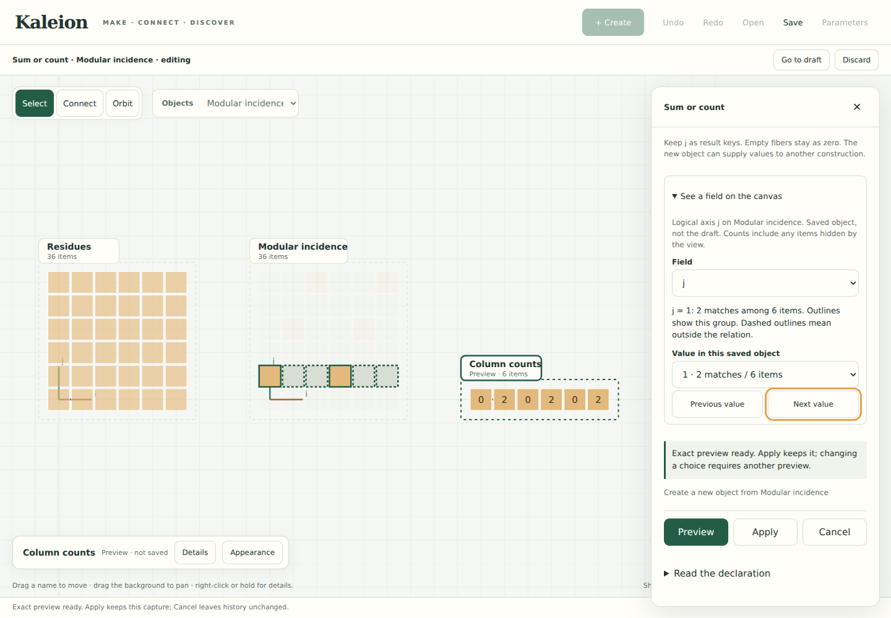

# See what a field describes

September 23, 2026 · Implemented studio interaction

A name such as `i`, `j`, or `value` is easier to understand when its values can
be explored beside the construction. **See a field on the canvas** lists values
from a saved object and outlines the items that share the chosen value. The same
guide works for a logical axis, integer contents, a retained key, or an annotation.
It does not assume that objects have rows or a rectangular placement.



## Use it

Run `python3 -m examples.studio` in the project's virtual environment.

1. Create a 6 × 6 Grid. In **Relation → Customize the formula → Write a rule**,
   enter `(j - 2*i - 1) % 6 = 0`, then Preview and Apply.
2. Open **Sum / count**. Total along `i` and retain `j`. Preview the counts.
3. In the field guide choose `j`. At `j = 0`, six source items exist but none
   match. At `j = 1`, two of the six match. Solid outlines identify matching
   members; dashed outlines identify candidates outside the relation.
4. Browse with Previous/Next or the value menu. The ready preview stays ready.
   Apply yields `[0, 2, 0, 2, 0, 2]` with the existing contributor evidence.
5. On those counts, start another relation. Explore `value`: three distinct
   measurements have value zero. These are existing items, not missing data.

Opening a structured field term also opens the guide in that term's context.
The written rule offers field buttons; the shared group selector offers the
same guide when a key is added. Other tools, including axis totals, start with
the guide collapsed. Inspecting `i = 2` fixes that coordinate; totaling along `i`
removes it from the result keys. Inspection is an explicit choice in the reduction
form so these opposite roles are not conflated by automatic focus behavior.
Opening the guide alone never changes the formula or grouping. Changing a
construction choice still invalidates its preview as before.

Inside a keyed read, the source key and supplied value belong to the driver;
the target key belongs to the receiving object. The guide names the object and
highlights only that object, even if both have a field with the same name or
share occurrence identifiers. Nested reads retain their enclosing contexts.

## Meaning and limits

- Groups come from the **saved object**, not the proposed relation or an
  animation frame. Their populations include items hidden by view slices or the
  drawing limit; highlights show only the currently drawn members.
  When a placement preview replaces the source under the same name, the guide
  explains that the saved source is hidden. It does not transfer that outline
  to a different capture merely because the name or item identifiers match.
- A retained empty axis group, an existing group with zero matches, and no
  observed field values are different outcomes. Failed inspection displays an
  error and clears the outline; it never invents an empty group.
- Values retain their exact wire representation. Adjacent integers beyond
  64-bit range remain separate choices; browsing order is not member order.
- The guide explores **one field at a time**. A multi-field group declaration
  remains a joint key; inspecting one component is not inspecting that whole
  composite fiber. Use **Groups** to inspect the joint selection.
- Parking a draft hides the outline and retains the browsing choice. Resume
  restores that choice; the existing draft policy requires a fresh preview after
  parking. Cancel, Apply, and a new capture clear the guide's transient emphasis.
- The camera, mathematical history, saved workspace format, and provenance are
  unchanged by inspection. No new core operation or public Python API is added.

## Module boundaries

| Decision that may change | Owner |
| --- | --- |
| Exact group domain, membership, zero fibers and capture identity | Existing captured group query behind `/api/groups` |
| Which object a field term addresses | Structured expression context; editors emit `inspect-field` with a field and optional driver name |
| Browsing controls, request lifecycle and late-response rejection | `field-guide.js` |
| Draft lifetime and query routing | `studio.js` |
| Color, outlines, projection and view filtering | `workspace.js` and CSS; consume scoped occurrence references |

This follows the project's Parnas criterion: the viewer does not calculate
fibers, the term editor does not retrieve captures, and the guide does not decide
how a field becomes a measurement. A new visual treatment can replace the
outlines without changing grouping or arithmetic.

## Validation and next experiment

```sh
python3 -m unittest discover -s tests -p test_studio_groups.py -v
python3 -m unittest discover -s tests -v
python3 examples/discovery.py --out build/example-output
node docs/studies/check-field-guide.cjs
node docs/studies/check-relation-notation.cjs
node docs/studies/check-continuous-canvas.cjs
```

Use the [optional browser setup](CONSTRUCTION_STUDIO.md#validation-and-reproduction).
The new group regression forbids evaluator execution while inspecting a ready
measurement preview, then applies that same preview. Browser tasks exercise the
modular counterexample, measured-value fibers, driver/target scope, a cube slice,
large exact contents, preview isolation, interruption, delayed/failed queries,
keyboard controls, and emulated touch on a narrow viewport. Browser fixtures
also check nested keyed-read scope independently of the construction tasks.

Recorded validation: **227 tests run, 223 passed, four optional Plotly checks
skipped** because Plotly is not installed in this host. The discovery example and
all three browser gates above pass in Chromium 153.0.8010.0. The desktop and 360 px
screenshots were inspected. No notebook, video exporter, dependency, or capture
schema changed, so this increment does not claim new notebook or video evidence.
The screenshot above comes from the field-guide gate; its other outputs stay in
the ignored `build/` directory.

These are correctness and layout checks, not evidence of novice understanding.
Next ask an author to predict a zero and a nonzero fiber, explain which object a
read addresses, then transfer the same controls to a lattice or point–line
relation. Observe whether automatic field inspection interrupts editing and
whether an explicitly requested guide would work better. Physical tablet and
screen-reader trials remain open.
