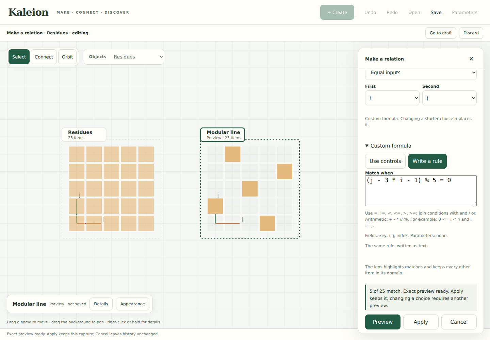

# A short rule, the same construction

September 23, 2026 · Companion to the [workspace survey](COMPARABLE_WORKSPACES.md)

**Relation → Customize the formula → Write a rule** offers a compact alternative
to editing each term. **Use controls** translates it back into the existing term
editor. Pattern starters remain the initial path; text is optional.

Run `python3 -m examples.studio` in the project's virtual environment. Create a
5 × 5 Grid with no contents, choose Relation, and enter:

```text
(j - 2*i - 1) % 5 = 0
```

Preview shows five matches. Apply captures the incidence. Sum / count along `j`
gives one count per retained `i`; each is 1. These are ordinary measurements with
contributors, available for the existing keyed placement tools. Try modulus 6
on a 6 × 6 grid, then total along `i`: the counts by `j` are `0,2,0,2,0,2`.
Changing the modulus breaks invertibility of the slope, not exact evaluation.



## Syntax and meaning

| Choice | Meaning |
| --- | --- |
| `i`, `j`, `value`, other listed fields | A field in this source; tuple-only grids have no `value` |
| A declared parameter name | Its exact current binding; a name shared with a field is rejected as ambiguous |
| Integers, `+ - * // %`, parentheses | Exact integer arithmetic; `//` is floor division and `%` requires a positive modulus |
| `= == != < <= > >=` | A comparison; the displayed symbols `≠ ≤ ≥` also work |
| `and`, `or` | Boolean combinations; `and` binds before `or` |
| `0 <= i < 4` | Both comparisons, `0 <= i` and `i < 4` |

Arithmetic binds before comparisons, which bind before `and`, then `or`.
Use parentheses to make an intended grouping visible. Multiplication is explicit:
write `2*i`, not `2i`. The mathematical minus and multiplication glyphs `−` and `×`
are accepted. The compact rule must consist of comparisons joined by `and/or`;
a number or bare field is not a predicate, even on an empty domain.

There are no calls, assignments, attribute access, subscripting, powers, real
division, `not`, or arbitrary Python execution. Names must be present in the
source or declared parameters. This is a bounded notation (256 input characters,
AST and expression-depth limits), not a new programming language.

Both sides of a Boolean combination are evaluated by Kaleion. In particular,
`i >= 0 or 1//0 = 0` fails even if all items have nonnegative `i`; it does not use
Python's short-circuit rules to hide an invalid calculation. Parsing success is
not evaluation success, and a finite successful preview is not a proof.

## Editing, failure and persistence

Switching to controls only parses the syntax. Preview alone evaluates the
proposal; Apply captures it. Short text and controls lower to the same existing
expression protocol and evaluator. A saved workspace contains structured
definitions and captures, not executable submitted text. No core operation or
saved schema changes in this increment.

Text-to-controls conversion preserves meaning, not spelling: `==` can display as
`=`, Unicode symbols can normalize, and a chained comparison becomes two visible
comparisons. The formatter retains necessary parentheses, including right-hand
subtraction/division groupings. Switching syntax views does not preserve a
separate term editor's local undo stack; workspace Undo still restores applied
captures. A draft can be parked and resumed with its active syntax view intact.

Malformed text remains available for correction. It cannot overwrite applied
work. Editing invalidates an earlier preview; a failed new preview cannot apply
the old result. A delayed syntax response cannot replace text typed after the
request. Changing a pattern starter still replaces the custom formula, as the
existing warning states.

Keyed reads, tuples, ambiguous field/parameter names, reserved names, and formulas
too large for compact text stay in the structured controls. The editor explains
why instead of silently dropping part of the construction. Reads remain useful
for measurement-driven placement; their omission from this small notation is
not a missing mathematical operation.

## Transfer investigations and ownership

The same control path constructs:

- A modular line, with an independently calculated remainder oracle.
- A lattice region: `0 <= i < 4 and j != i or i+j = 8` on a 5 × 5 domain.
- Fano incidence on a 7 × 7 domain, encoding points and lines by the nonzero
  three-bit vectors `i+1` and `j+1`. The rule takes their bitwise dot product
  modulo 2. Tests find 21 incidences, three points per line, and one shared point
  for every distinct pair of lines. This is arithmetic in the coordinates over
  `F_2`, not multiplication modulo 7 or a new implementation of the full code
  lesson. The long bit formula is also evidence for a future reusable recipe.

`formulas.py` owns bounded parsing and explicit name resolution. `notation.js`
owns the two syntax views, formatting and delayed-response handling.
`patterns.js` supplies starters; the studio adapter lowers declarations and
retains the existing Preview/Apply contract. Core evaluation, history, receipts,
motion and rendering keep their existing responsibilities. Neither parser nor
formatter calculates a mask or a measurement.

## Validation and remaining questions

```sh
python3 -m unittest discover -s tests -p test_studio_formulas.py -v
python3 -m unittest discover -s tests -v
python3 examples/discovery.py --out build/example-output
node docs/studies/check-relation-notation.cjs
node docs/studies/check-continuous-canvas.cjs
```

Use the [existing optional browser setup](CONSTRUCTION_STUDIO.md#validation-and-reproduction).
Seven focused unit tests cover the independent mathematical cases, exact large
integers, retained zero groups and receipts, empty sources, ambiguous names,
invalid/eager Boolean rules, captured rule reuse, and read-only syntax conversion.
The required suite ran **226 tests: 222 passed and four optional Plotly tests
were skipped** because that dependency is absent in this environment. The
discovery example passes.

Chromium 153 checks the three blank-canvas constructions, text/control editing,
retained drafts, failed previews, a deliberately delayed parser response, keyboard
switching, 360-pixel layout, and saved undo/redo. The continuous-canvas regression
also passes, including emulated touch and captured replay. Screenshots were
inspected. No notebook or video changed. The checks do not establish physical
touch/keyboard comfort, screen-reader conformance, or novice comprehension.

The next observation is whether a learner can invent a variation and explain its
counts. If identifying fields is harder than typing, link selected expression
parts to their visible scope before expanding this notation. See the survey's
prioritized experiments; a shorter advanced input should not become the required
entry point for novices.
