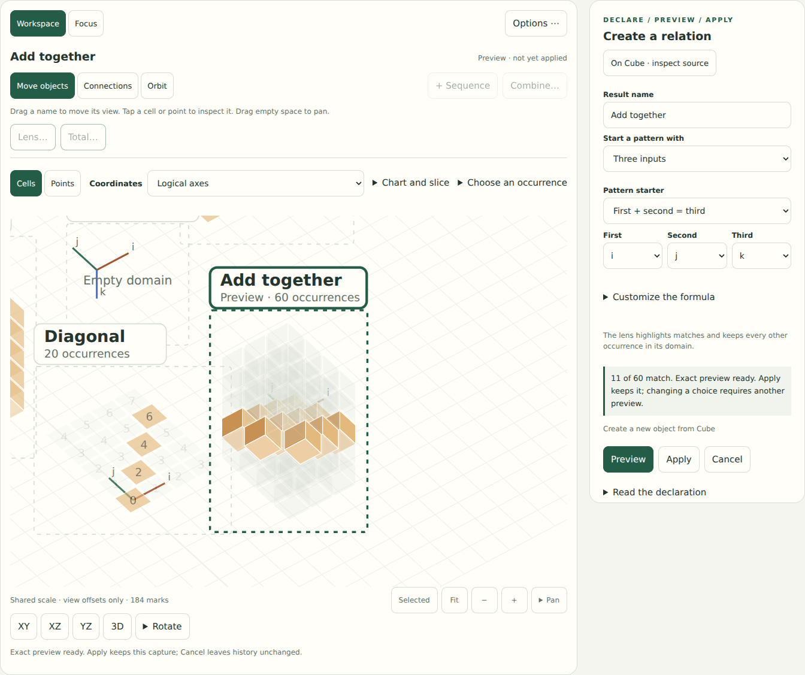
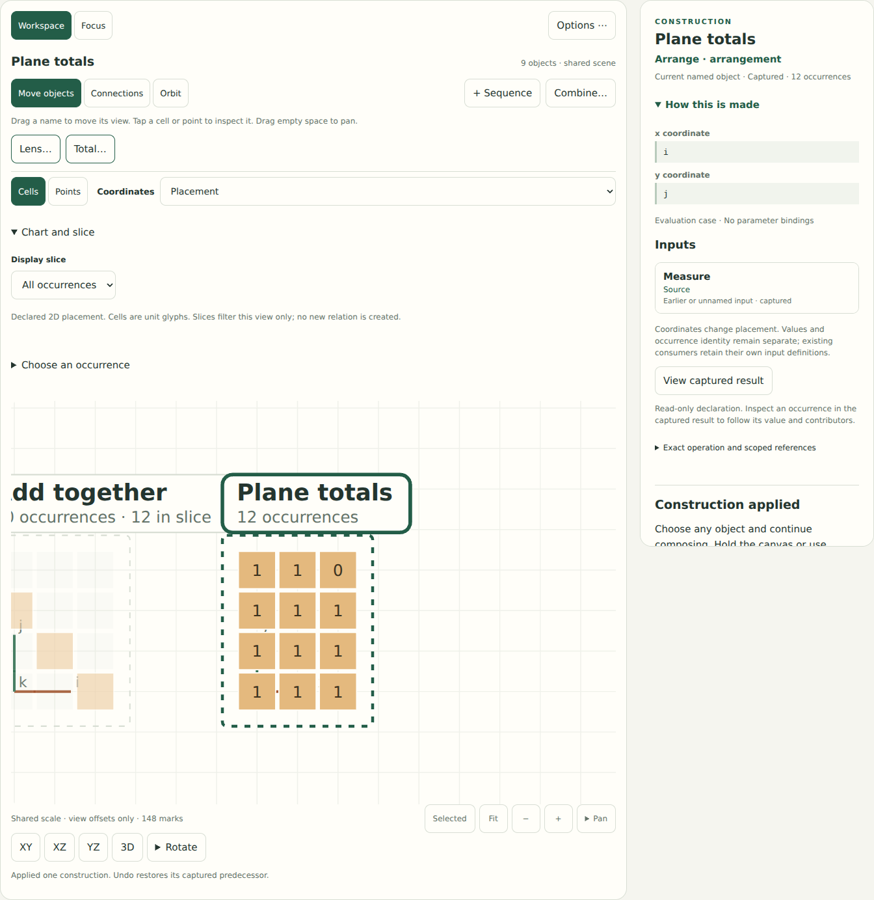

# Make a lens, move its rule, pull out a total

**Current interface:** see [One canvas, fewer decisions](CONTINUOUS_CANVAS.md).
The continuous-canvas refactor replaces Focus and the earlier menu/tool layout.
The contracts and dated implementation record below remain useful; use the new
guide for current control names and the current browser gate.


The shared canvas now has a short construction path beside the selected object:
**Lens…**, **Reuse lens…**, and **Total…**. Pattern starters cover one, two or three
scalar field inputs; the existing structured formula editor remains available
under **Customize the formula**. Preview draws the proposed incidence in the
shared scene, with its match count beside the form. Apply retains that exact
capture as another object. Existing inputs stay available.

This brings a bounded part of step 4 in the [unified canvas plan](UNIFIED_CANVAS_DESIGN.md)
forward in response to the maintainer's request for easy relation construction,
transfer and reduction. Visible captured replay/case tracks remain the next
separate increment. No core primitive, evaluator, dependency or saved-format
change is introduced.



## A first pattern

Run `python3 -m examples.studio` in the existing Python environment.

1. Use **+ Sequence** to make six integers, then choose **Lens…**.
2. Keep **One input → Even numbers → value**, and choose **Preview**. Three of
   the six occurrences match. **Apply** keeps the lens; **Cancel** returns to the
   previous view and leaves the mathematics unchanged.
3. Open `examples/canvases/07_equal_sums.json` and select **Pairs**. Choose
   **Lens… → Two inputs → Sum is…**. Map the inputs to `left` and `right`,
   keep the number `3`, then Preview/Apply. Four of the sixteen pairs match.
4. Select that lens and choose **Reuse lens…**. Choose **Moving pairs** as the
   destination and review `left → left`, `right → right`. Preview/Apply displays
   the same predicate on the rearranged pairs, retaining the original lens.

One-input starters include even numbers and threshold comparisons. Two-input
starters include equality, less-than and a fixed sum. Three-input starters include
`a + b = c`, ordered inputs, and a fixed total. Edit any starter's formula to use
the existing arithmetic, Boolean operations, parameters or keyed reads.

The input count describes scalar fields in these starters. It does not infer
relation arity from spatial dimension or provide a general schema for structured
point/line/plane arguments. Several arguments may be mapped to the same field;
the displayed predicate states what will actually be evaluated.

## Reuse a captured predicate

**Reuse lens…** reads the actual saved predicate. Every field it uses appears as
an input mapping to the destination. Matching field names are shown for review;
missing names require a choice. Equal shape, screen proximity and matching values
do not supply a correspondence.

In **Connections**, drag a lens name onto another object, then choose **Use lens
on destination**. **Combine…** offers the same operation through selectors. A drop
opens a proposal and makes no evaluation or history edit.

Copying a predicate retains both the original lens and the destination. The new
incidence has the destination's occurrences, values, placement and universe.
It can be measured, inspected, saved and undone through the existing tools.
The copied rule is an immutable definition; it does not follow later edits to
the original lens.

Parameters become exact constants from the source lens's captured case, displayed
in the reuse form. This includes nested local cases. The destination keeps its
own parameter environment. For example, reusing a locally captured `i < p` with
`p = 2` on a sequence whose length uses global `p = 4` keeps four candidates and
compares their mapped field with **2**. Later global case changes can change the
destination, while the copied threshold remains 2.

This increment supports scalar numeric/Boolean predicates, including arithmetic,
comparisons, Boolean combinations and captured integer parameters. Rules with
definition-valued reads, structured arguments or unsupported constructors show a
reason and remain inspectable. No rule is inferred from a finite mask, painted
support, or an unavailable capture. Standalone rule tokens, editable dependency
bindings, detachment and general incidence composition remain future work.

## Total along one or several directions

Open `examples/canvases/03_incidence_box.json`, select **X region**, then choose
**Total…**. **Count matches** counts incident occurrences; **Sum weights** adds
an explicit weight formula, initially `value`.

- Check `k` to total through the third axis, retaining `i, j`.
- Check `j` and `k` to produce one result per `i`.
- Check all three axes to make one total: **86** for X region's captured example.

The new object retains the remaining fields as **keys**. When one to three numeric keys
remain, an ordinary Arrange operation displays them as coordinates. A reduction
does not manufacture a new logical grid. Select a reduced object and choose
**Total…** again to reduce its retained keys. Sum is the default for collections
and measurements; Count is the default for an incidence. This makes cube → plane
→ line → scalar possible through the same control.



The declared pre-mask domain supplies zero fibers. Reducing an empty axis in a
`2 × 0 × 3` grid over its middle axis produces six zeros. Other grouping fields
retain the core's observed-key policy; they do not invent absent keys. A view
slice filters the picture only: Total uses the complete captured relation.

Each result remains a normal mathematical object. Inspect its values to follow
contribution weights and sources, or use it as a keyed field/coordinate driver
in another construction. The construction inspector shows the real Arrange and
Measure definitions. **Options → Measure** retains arbitrary grouping, member
order, rank, prefix sums and the other detailed controls.

## Preview, drafts and saving

Canvas-side previews are labeled and cannot be mistaken for an applied root.
Changing a choice invalidates the preview. Parking a draft restores the applied
scene; Resume returns to its original object, form and canvas surface. Cancel
restores the previous scene camera. Saving during a preview includes applied
mathematics and its view, excluding the temporary result.

While editing here, a compact **On … · inspect source** button replaces the full
construction sheet. It parks the draft and opens the source's construction;
Resume restores the same controls. The three input fields share one row to keep
the preview actions within easier reach.

Both the ordinary schema-1 workspace and version-1 canvas envelope remain
unchanged. Applied predicates, constant bindings, reductions, placements,
contributors and history use existing definitions and captures. Opening and
undoing/redoing saved work do not evaluate the graph.

## Evidence and next observation

Six semantic tests exercise one/two/three-field transfer onto a different domain,
local-case constants, invalid/stale mappings, unsupported reads, large exact
weights, zeros, repeated reductions, contributor inspection and captured restore.
The required suite passes **212 tests**; the discovery example and geometry/document
checks pass. Chromium gates cover the new workflow plus shared scene,
construction inspector, spatial workspace, saved canvases and full studio.
The new gate uses actual controls for a lens drag, field binding, a view slice,
repeated reductions, draft isolation, save/reopen and 320/360-pixel layouts.

```sh
python3 -m unittest discover -s tests -v
python3 examples/discovery.py --out build/example-output
node docs/studies/check-continuous-canvas.cjs
```

Use the existing [optional browser configuration](CONSTRUCTION_STUDIO.md#validation-and-reproduction).
Screenshots are application captures, not concept art or participant observations.

The intended ease comes from a short pattern choice, an immediately visible exact
preview, reusable results and easy reversal. These are design hypotheses, not
claims of child usability. Ask a new user to make a different pattern, move its
rule to another object, predict a total, and explain a zero without instructions.
Record help, wrong turns, scrolling and what they think a slice changes. Physical
touch, child/novice sessions, screen-reader review and comfort on actual devices
remain open. The [UI study](UI_DESIGN_STUDY.md) records the tradeoffs.
