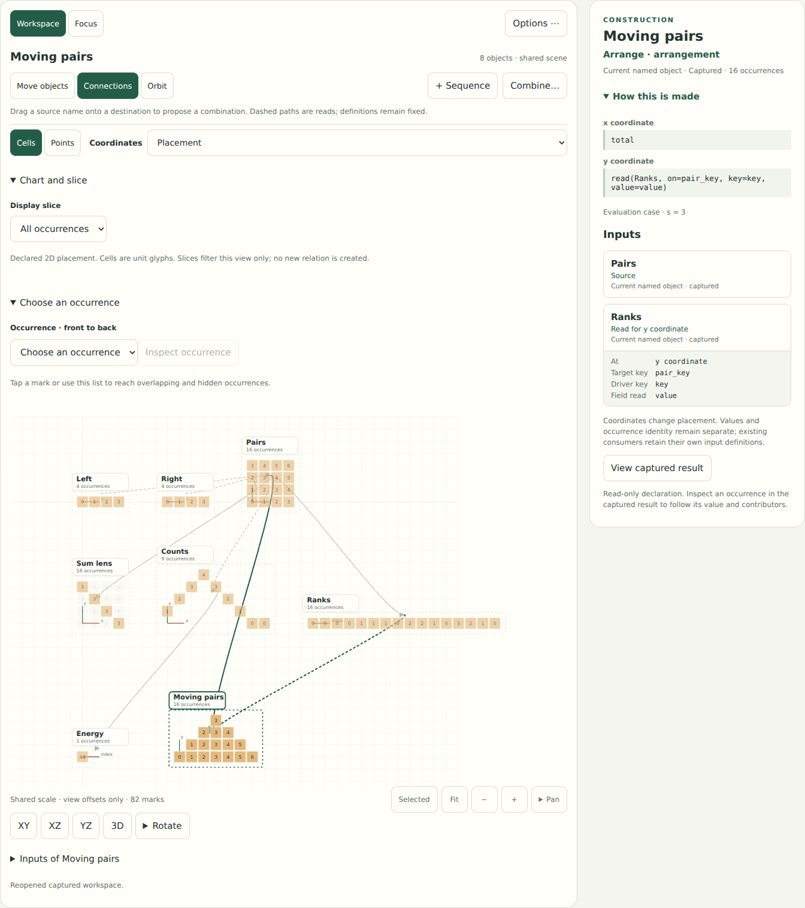
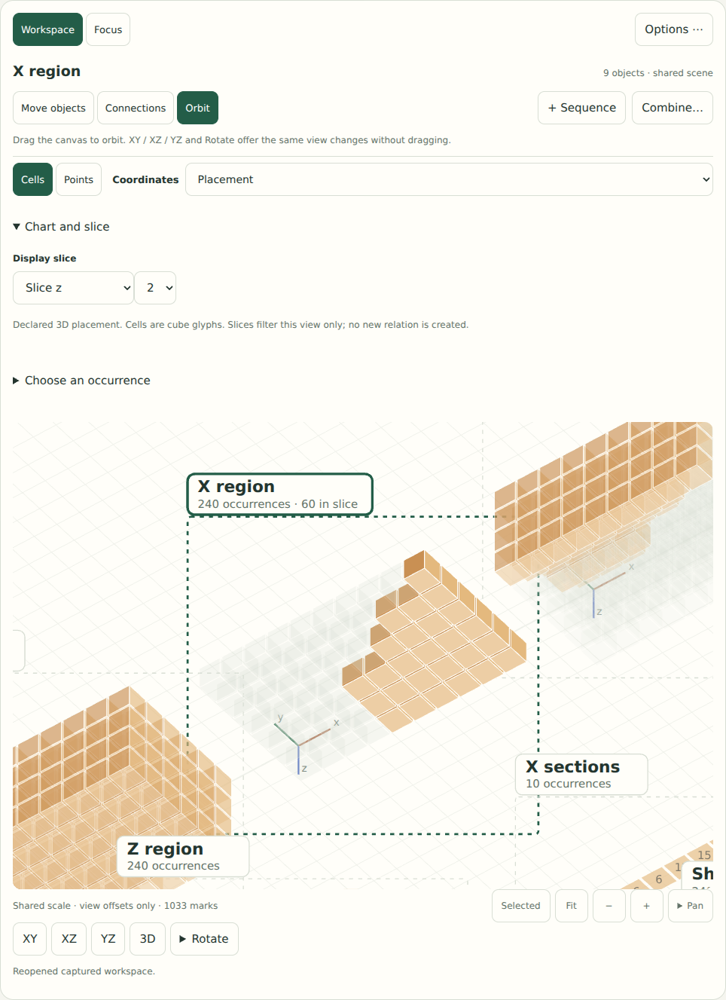

# A shared scene for cells, points and three-dimensional relations

The workspace now draws captured objects on one coordinate scale, with local
axes and separate view offsets. Selecting a mark leads into the existing captured
evidence; selecting its name opens construction inspection. This implements the
second step of the [unified canvas design](UNIFIED_CANVAS_DESIGN.md).

The subsequent [relation workbench](RELATION_WORKBENCH.md) adds quick one/two/three
input pattern starters, explicit lens reuse, and repeated axis/key totals. These
forms preview a new object beside its inputs in this scene.



## Start with the objects

Run `python3 -m examples.studio` in the existing environment. Open
`examples/canvases/07_equal_sums.json`, then select **Moving pairs**.

- **Cells / Points** changes its marks. Its occurrences, selected reference,
  coordinates, and camera stay the same. Values label cells when there is room;
  hover or inspect to read the full exact value.
- **Coordinates** chooses **Placement** or **Logical axes**. The first uses the
  evaluated x/y/z positions; the second uses explicitly chosen logical fields or
  flat `index`. This changes the chart, not the mathematical construction.
- Drag an object's **name** to organize its view. Local axes move with it.
  **Move objects** and arrow keys change only that view offset. Drag empty space
  to pan. **Fit** includes every object's full displayed domain; **Selected**
  centers the selected object at a readable scale.
- Tap a cell or point to inspect its captured occurrence. **Choose an occurrence**
  supplies a list ordered from front to back, retaining repeated labels, coincident
  points, and occurrences hidden by a slice. No screen proximity becomes a key.
- **+ Sequence** opens length, start and step declarations. Preview/Apply creates
  an exact finite source and returns to the scene. These expressions can use
  declared parameters; general recurrence is separate future work.
- In **Connections**, drag a source name onto a destination. A labeled combine
  target appears. Release opens the existing Product / keyed Arrange proposal;
  it does not evaluate or commit. **Combine…** supplies the same tap/keyboard path.
  Creating a product retains both sources as independently selectable objects.

Independent objects share one scale; a sixteen-item sequence is visibly longer
than a four-item sequence. The offsets are not a claim that the objects inhabit
one mathematical universe. Connections still describe immutable definitions,
including the earlier-input boundaries shown in construction inspection.

## Explore a three-dimensional relation

Open **[03_incidence_box.json](../examples/canvases/03_incidence_box.json)** and select
**X region**. Choose **Selected**, then **3D** or **Orbit**. Camera buttons offer
**XY**, **XZ**, **YZ**, and directional rotation without dragging.



Under **Chart and slice**, choose **Slice z**, then **2**. Sixty of the box's
240 occurrences lie in this displayed plane. The highlighted cells satisfy the
selected relation; subdued cells remain outside it. The original relation still
has 240 candidates and 86 matches. **All occurrences** removes the filter.

The saved construction uses `(a,b,c)=(11,7,5)`: the three regions have volumes
86, 80 and 74, and **Shared cells** has no matches in its retained 240-cell domain.
The volume measurements lead to contributors through the same inspector as
other lessons. Changing assumptions uses **Cases** and explicit evaluation.
A slice is only a view filter; it is neither a newly evaluated case nor a new
relation. Camera depth is also independent of the planned time axis.

Cells are unit glyphs: squares for one/two displayed coordinates, cubes for
three. An arbitrary placement does not become a regular tiling or acquire an
adjacency relation because it uses these marks. Projecting out a logical axis
can make several occurrences coincide; the chooser retains them all.

## Save the mathematics and the view deliberately

**Save → Canvas and view** records the mathematical workspace plus object offsets,
per-object chart/mark/slice choices, selected object/occurrence, camera, and active
scene tool. **Open** restores the scene without evaluating the graph.

**Save → Mathematics only** retains the ordinary schema-1 workspace for Python
and other Kaleion clients. The five committed examples remain ordinary workspaces
and open in both clients. Both save choices retain captured evidence and history;
unfinished drafts remain tab-local. Focus/evidence cameras and their navigation
stacks are temporary, separate from the saved shared-scene camera.

The canvas document is a version-1 `kaleion-studio` envelope. Its mathematical
workspace is stored as the **original JSON text**, not parsed and re-encoded in
JavaScript: doing that would round large exact integers. `document.js` validates
the separate bounded view record and rejects unsupported versions before import.
The backend export endpoint and the core workspace schema have not changed.

## Owners and limits

`scene.js` owns coordinate projection, glyph geometry, and full-domain bounds.
`workspace.js` owns the scene, picking, view controls and gestures. `document.js`
owns view persistence. The Python snapshot adapter provides declared shape in
addition to the existing axes, positions, membership and scoped references.
Sequence authoring lowers to the existing pure builder. No core operation,
dependency, or numerical evaluator has been added.

This is an orthographic SVG renderer for the bounded studio. It draws at most
6000 occurrences, prioritizing the selected object and labeling omissions.
Fitting still considers complete domains; all captured occurrences remain in the
chooser and existing Focus tools. Coordinates outside the bounded floating
display range are explicitly unavailable while exact fields remain inspectable.
Dense voxels and long sequences still need camera adjustment, slices and lists;
this is not an unbounded or GPU performance claim.

The shared scene handles captured 3D data. **Focus**, paired evidence, and current
replay retain their existing labeled XY views. This increment does not add 3D
motion rendering, recurrence, live editable wires, or the persistent transport
planned next. Existing lesson tools, case controls, and undo/redo remain available.

## Validation and next observation

The required **206-test** Python suite and discovery example pass. New contracts
cover exact sequence construction and invalid bounds, retained empty/3D shape,
nonincident occurrences, and the saved box's disjoint finite partition with
inspectable contributors. Offline JavaScript checks verify named projections,
camera-plane movement, identity-preserving chart/slice geometry, unavailable
extents, lossless large-integer documents, and rejected versions/cameras.

```sh
python3 -m unittest discover -s tests -v
python3 examples/discovery.py --out build/example-output
node docs/studies/check-scene-model.mjs
node docs/studies/check-shared-scene.cjs
```

The shared-scene browser gate exercises actual creation, mark picking, chart
changes, slices, camera cancellation, saved-view restoration, exact integers,
failed/empty objects, and phone-width controls. The construction-inspector,
spatial-interaction, saved-canvas and full-studio gates remain regression checks.
Browser setup uses the existing [optional Playwright configuration](CONSTRUCTION_STUDIO.md#validation-and-reproduction).

The next human task is to build two sequences and a product, then explain the
difference between changing its marks, its displayed coordinates, and its
mathematical placement. Try a 3D slice and return to a selected contributor.
Physical phone/tablet, Safari, screen-reader, performance-on-device, and novice
transfer studies remain open. The [UI study](UI_DESIGN_STUDY.md) records these
limits separately from the behavioral test results.
