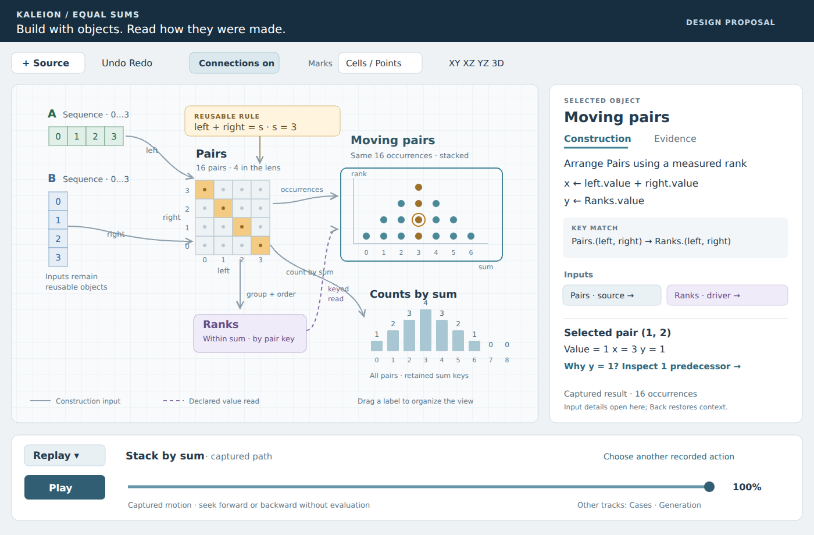

# A canvas you can build with

September 23, 2026 · Design proposal after reviewing Icarus and merged Kaleion PR #29

**Recommendation:** make the mathematical objects themselves the working surface.
Keep an object's construction visible beside it, let rules be picked up and reused,
and give every scrubber a declared subject. Carry Icarus's direct, spatial actions
into Kaleion's exact definitions, captured evidence, and reversible history.

**Latest priority:** maintainer feedback on crowding and disorientation pauses the
feature sequence below. The [continuous-canvas reset](CONTINUOUS_CANVAS.md) removes
Focus, replaces source menus with Vector/Grid/Cube, and keeps inspection and replay
in the shared scene. A general timeline remains future work; the next acceptance
question is whether an uncoached author can make and inspect a construction.

This records the design proposal and its implementation sequence. Its first two
steps, [construction inspection](CONSTRUCTION_INSPECTION.md) and the
[shared scene](SHARED_SCENE.md), are now implemented. The maintainer's subsequent
request prioritizes quick relation construction, transfer and reduced sums. The
[relation workbench](RELATION_WORKBENCH.md) brings that bounded part of step 4
forward. A library of captured tracks remains planned after the interaction reset.
The larger direction is one spatial canvas with several representations; the
remaining proposal does not describe already implemented capabilities.

*Concept drawing, not an application screenshot. It uses the equal-sums example:
two four-item sources produce sixteen pairs; grouping by sum produces counts
1, 2, 3, 4, 3, 2, 1, 0, 0, retaining two empty bins; rank supplies the stacked placement. The selected point (1,2)
has sum 3 and one earlier pair in its fiber. Connections and details are shown
together here to explain the design; they need not always be open.
[Vector source](images/unified-canvas-concept.svg).*

## What the comparison actually showed

The maintainer reports that selecting a Kaleion object still does not make its
construction clear, and identifies Icarus's canvas, products, relation extraction,
and interaction as useful references. This continues the earlier request for a
workspace that feels alive. It is direct project feedback, not a novice trial.

The review used Kaleion `00d92028d7da08b07475a126204e42f09d362b0e` and
[Icarus `935dda4`](https://github.com/virgil-barnard/Icarus/tree/935dda494af043b75043aecb5d9d278db2b8a3cb).
Icarus's README calls the application ModScope. Both implementation and design
documents were inspected; a feature in a design document was not assumed to work.

The table records that baseline; the implemented increments above supersede its
Kaleion preview and inspection limitations.

| Area | Observed implementation | Design consequence |
| --- | --- | --- |
| Icarus vectors and products | The ordered-domain pen draws cell vectors. Bringing a row and column together creates a matrix with the operands as headers. The standalone source cards are removed. | Preserve direct creation and operand headers. Headers should be views of retained input objects, so construction, reuse, and identity survive docking. |
| Icarus relation extraction | A lens corner can be dragged out as a token and attached again. The payload can carry a formula or explicit support. | Make reusable rules tangible. Show whether a token is a rule or a finite selection, and keep its domain bindings inspectable. |
| Icarus inspector | Vector details emphasize id, axis, length, color, and preview. Relations add formula editing and topology metadata. | A selected-object inspector is useful, but the first content should be the constructor and inputs, not internal identifiers. |
| Icarus generation and depth | The pen offers linear and Fibonacci generation. The vector's depth option uses diagonal screen offsets; a general 3D relation renderer is still prospective. | General recurrences and genuine 3D remain development work. Do not mistake a diagonal vector for a third mathematical coordinate. |
| Icarus composition | The backend implements Boolean composition. The UI's animated witness scan performs its own loops before requesting the derived result. | Keep the visible witnesses; evaluate and capture first, then replay a seekable explanation. The animation must not own the mathematics. |
| Kaleion spatial workspace | Named roots appear together, with reviewed Product/Arrange proposals and definition paths. Views currently use independent XY scales and bounded previews. | Useful progress toward object composition; still short of a shared spatial construction surface. |
| Kaleion inspection | Captured receipts distinguish occurrence value, contribution, keyed driver read, and source. The root description currently gives essentially an operation name and object name. | Preserve the evidence chain; add a readable account of the object's definition before asking the author to select an occurrence. |
| Kaleion dependencies | Definitions are immutable. Replacing a named root does not retarget its existing consumers. | Editable cables need an explicit authoring contract. Drawing a cable must not imply live propagation that the current graph does not provide. |

The Icarus frontend built successfully. A local Chromium walk-through exercised
vector drawing, vector inspection, drag-to-product, the formula `x + y == 3` on
two six-item domains (four matches), lens extraction, and reattachment to the
same matrix, with no page errors. Composition, Boolean operations, recurrence,
and depth were source-inspected, not browser-validated in this review. No physical
touch or human usability trial was conducted. Private research copies and browser
captures are not included in this repository.

Source anchors: Icarus `ui-web/src/components/WorkspaceCanvas.tsx`,
`VectorSetCard.tsx`, `MatrixView.tsx`, `ObjectInspectorPane.tsx`, `ui-web/src/App.tsx`,
and `modscope/relations.py`; Kaleion [adapter](../examples/studio/adapter.py),
[public builders](../src/kaleion/api.py), [Product](../src/kaleion/products.py),
[Sweep](../src/kaleion/sweep.py), and [current workspace contract](SPATIAL_WORKSPACE.md).

## Selection should answer “How was this made?”

Select an object by its label, outline, object list, or keyboard. Open a compact
**Construction** sheet automatically; selecting an occurrence adds a **Why this
value?** section without replacing the object's construction context.

The sheet should answer these questions in order:

1. **What is it?** Name, mathematical kind, and one readable declaration. For
   example: “Moving pairs — arrange Pairs by sum and measured rank.”
2. **What did it use?** Clickable input names with roles. Expand unnamed steps
   and expressions in place. Selecting an input highlights it on the canvas;
   Back restores the original selection, sheet, and camera.
3. **Which choices matter?** Constructor arguments, exact parameters, grouping,
   order, keys, expected domain, and coordinate expressions, as applicable.
   For a keyed placement show `target pair key → Ranks pair key → value → y`.
4. **Which case/result is shown?** Parameter bindings and ready, failed, or pinned
   capture status. Distinguish an earlier input definition from today's object
   with the same name. Internal IDs and serialized declarations are expandable.
5. **What can I do here?** Contextual Edit, Combine, Reuse rule, Cases, or Replay
   actions. An unsupported imported constructor stays readable and inspectable;
   the UI must not silently rebuild it from a simpler form.

For a sequence, show start, step, and finite length. For a recurrence, show seeds,
update rule, output field, and bound. For an incidence, show universe, rule, and
argument mapping. For a measurement, show reducer, weight, group, order, and zero
coverage. For an arrangement, show source, coordinate expressions, and reads.
Do not flatten these into a generic list of values.

“How made” reads the immutable definition; “why this value” reads the captured
evaluation. Neither action should evaluate or alter the workspace. An unavailable
result can still have a readable definition. A zero measurement still has a
domain and an explanation.

Some public recipes, notably `Product`, compile to ordinary operations without
retaining the wrapper as an IR node. Display the actual definition faithfully;
do not reverse-engineer an intended recipe from its picture. Future authored
recipes should retain their human declaration alongside the compiled graph.

## One scene, several honest representations

Three different uses of “grid” need distinct treatment:

| Grid or coordinates | Purpose | What changing it means |
| --- | --- | --- |
| Workspace grid | Orient and organize objects, with optional snapping | View organization only |
| Logical chart | Show slots, ordered axes, and relation arguments as a line, table, or cube | Select a representation and explicitly choose its axes |
| Mathematical placement | Show evaluated x/y/z fields, including measured positions | Editing these fields creates a mathematical construction |

Use a common scene camera with visible local frames for independent objects.
An object's workspace offset is separate from its mathematical coordinates.
Dragging its label moves the view; it does not change a value, slot, or relation.
At a conceptual rendering boundary: camera × object view pose × captured geometry.
Several views may refer to the same object without duplicating its definition.

**Cells / Points** chooses marks within the selected chart. Preserve occurrence
identity, selected keys, evidence references, and camera focus when switching.
A regular domain can use cells or voxels, including subdued nonincident cells.
An arbitrary scatter can use points or small cube glyphs; it must not suggest a
regular tiling or new adjacency. **Logical axes / Placement** is a separate
choice, because changing that mapping is more than an aesthetic change.

The 3D scene needs orbit, fit, named XY/XZ/YZ views, coordinate labels, and a
depth-aware occurrence chooser. Dense relations also need slices or linked
orthographic views. A visible `z = k` slice is a display filter unless explicitly
converted to a predicate. Zero-length axes and empty incidences remain selectable.
Use the full declared domain when fitting; viewport culling cannot change it.

Keep these actions distinct, with a preview saying which one is active:

- Orbit the camera or orient an object's view in the workspace.
- Permute logical axes, including their roles, shape, and addressing.
- Change the mathematical placement, such as mapping a sequence onto x, y, or z.
- Transpose a binary relation, exchanging its argument roles.

**Relation arity is not spatial dimension.** A binary point–line relation can
have structured point and line arguments; it is not necessarily a rectangular
plane in Euclidean space. A ternary relation may be displayed as a cube or as
slices. Time does not consume the third spatial coordinate.

## Make combination a spatial action with a readable result

Dragging an object moves its view. Near another object, a labeled **Combine**
target can appear; releasing over that target opens a small contextual proposal.
Ordinary overlap remains possible. Ports in Connections mode offer a more precise
route. Multi-select → Combine supplies the same interaction without dragging.
The proposal shows the result's kind, size, roles, and any necessary alignment
before Preview/Apply. Merely hovering or dropping must not evaluate or commit.

| Inputs | Useful proposals | Choice that must stay explicit |
| --- | --- | --- |
| Two ordered collections | Concatenate; every pair; aligned addition/subtraction/product | Join axis; product roles; alignment by slots or declared keys |
| Numeric vectors | Dot product; when appropriate, vector cross product | Component axis, compatible lengths, arithmetic domain; cross product requires the declared three-component convention |
| Rule + domain/product | Apply as a lens | Map named rule arguments to fields and bind free parameters |
| Two rules | AND / OR / NOT where appropriate | Compatible argument schema and parameter bindings |
| Two incidences | Union, intersection, difference | Same declared universe and scope, or an explicit common-universe construction |
| Composable binary relations | Compose through a shared middle argument | Direction, middle domain/correspondence, and existential membership versus witness count |
| Measurement + arrangement | Use as a field, weight, or coordinate | Target keys, driver keys, field read, and destination |

Call a Cartesian product **Every pair (Cartesian product)**, rather than the
ambiguous “cross product.” Equal shape alone does not establish correspondence.
Two displayed 4×4 grids can have different universes, orders, or parameter scopes.
Explain an incompatible choice nearby and offer the required mapping; do not
silently coerce it or present an unexplained disabled icon.

The sense of play should come from immediate previews, snapping to meaningful
targets, visible consequences, small transformations, and easy reversal. It does
not require a score system, compulsory lesson path, or extra permanent tool modes.

## Rules you can pick up and use again

Kaleion already has a pure reusable `Lens(rule)` builder and Boolean operations
on lenses/incidences. What is missing is a persistent, visible authoring object
and a clear application/binding interaction.

Expose three related things without inventing three new numerical primitives:

- **Rule:** a predicate with named arguments, requirements, and free parameters.
  It can be named, placed on the canvas, copied, combined, and reused.
- **Lens application:** that rule bound to one declared universe and field mapping.
  Its handles edit declared parameters; its corner exposes the reusable rule.
- **Incidence:** the evaluated membership over that universe, available for
  selection, measurements, combinations, and evidence inspection.

**Reuse rule** leaves the current lens in place and creates another reference.
**Detach lens** removes the application from that view while retaining its domain
and inputs; it must not destroy a named incidence still used by a measurement.
Any deletion or change of a mathematical root is a separately declared edit.
Commit extraction and its reusable object together so a failed request cannot
leave half the action applied. Undo restores the whole action.

A painted selection instead produces **Saved support**, with its explicit domain,
keys or scoped identities, and captured case. Dropping it elsewhere requires a
declared mapping and reports missing or ambiguous matches. It does not become a
formula by inference. A symbolic rule can transfer more broadly, but its argument
types and local parameter bindings travel with it. Support for integers modulo
four must not be advertised as a rule over a field merely because the display
resembles the prime case.

Input headers on a product remain linked views of their sources. The original
objects can stay on the canvas, be hidden, or appear elsewhere as aliases. Docking
must not consume their mathematical identity or erase their construction.

## Give relation animations something precise to explain

For union and intersection, retain the universe and show membership from each
input separately. The final mask is already evaluated. A selected member explains
“left,” “right,” or “both”; an excluded member remains inspectable. Appearance and
color transitions illustrate those facts, rather than manufacturing membership.

For composition, let `R ⊆ X × Y` and `S ⊆ Y × Z`. Display the direction explicitly:

`(x,z) ∈ S ∘ R` exactly when some declared `y` satisfies `R(x,y)` and `S(y,z)`.

Keep the witness relation `W ⊆ X × Y × Z`. Its cube makes the shared middle axis
visible; projection onto X×Z uses **any**, while a separate measurement **counts**
witnesses. A replay highlights captured y-witnesses and their contributions to an
output pair. Seek and reverse sample the same trace, without rerunning evaluation.

A small acceptance fixture is:

- X = Z = {0,1}, Y = {0,1,2}.
- R = {(0,0), (0,1), (1,1), (1,2)}.
- S = {(0,0), (1,0), (1,1), (2,1)}.
- Six triples witness all four output pairs; witness counts are [[2,1],[1,2]].
  Boolean composition contains each output pair once.

Reorder the middle-domain storage and preserve the result under declared keys.
An empty middle domain produces false membership/zero counts for the independently
declared X×Z output universe. Incomplete input data is not the same as a complete
relation with no matches.

First investigate an exact recipe using the existing three-factor Product,
declared reads, Boolean predicates, and grouped any/count with explicit output
coverage. This is not a claim that a general composition builder or efficient
join already exists. Avoid materializing a huge cube merely to display its slices;
introduce a bounded join operation only if a concrete construction exposes that
need. Witness provenance, including zero outputs, is part of the contract.

## One visible transport; the track says what it means

The transport should be discoverable on opening a saved canvas, with recorded
actions listed directly. Requiring Undo then Redo to find replay is a workaround.
Keep the chosen object and track label visible even when the sheet is closed.

| Track | What is captured | What scrubbing means | What changes the mathematics |
| --- | --- | --- | --- |
| **Cases · p** | An ordered list of exact parameter bindings and evaluated results/errors | Select a retained case, such as `p = 4 · 2 of 5` | Explicit Evaluate cases, or Apply this case |
| **Generation · n** | A bounded recurrence trace with states and causal inputs | Reveal a retained step or prefix, such as `step 12 of 20` | Generate/extend the trace, or explicitly use a prefix/state in a construction |
| **Replay · Stack pairs** | Captured endpoints and a recorded motion or explanation trace | Sample presentation progress, such as `40%` | Nothing; no mathematical evaluation |

This sharpens the earlier time proposal: acquiring new samples can evaluate;
**seeking retained samples does not**. An uncaptured case is visibly unavailable
until evaluated. Rapid drag previews may request/coalesce evaluation in an editor,
but a playback track must not secretly do so. Superseded responses cannot replace
the current revision. All related unpinned views show one coherent captured case;
deliberately pinned comparisons display their own bindings.

Create a case track from an exact interval with step, an ordered manual list, or
an arrangement's chosen value field and member order. Show which quantity is
being read. An axis position is an ordinal visit, not automatically the parameter
value or elapsed time. Repeated values may be separate visits; invalid cases remain
visible failures. A tick between p=3 and p=4 cannot create p=3.5. Playback speed
changes presentation duration, not the declared ordering.

For the saved Radon example, p=4 must retain the counterexample where division has
zero remainder yet the reconstructed value is wrong. The comparison, field reads,
and source receipts must belong to that same case. A stale p=3 picture is never
relabeled p=4. Scrubbing adds no history actions; applying a selected case adds one.
Editing a historical sample requires a visible new draft based on that sample,
not an accidental edit of the latest state.

A handle on a lens can bind to a declared case parameter. Right-click/hold offers
**Add case track**; a visible button offers the same action. Dragging an arrangement
onto the track proposes its field and order. A spatial slice has its own labeled
control. No ambient variable named “time” is inserted into every expression.

“Measure across cases” is a separate mathematical construction: a collection with
case keys, parameter bindings, measured values, and captured origins. It is needed
for lesson 08 and is a backend gap; saved playback history is not that collection.
Transitions between changing domains must use an explicit correspondence or
clearly show creation/removal, rather than inventing an occurrence match.

## Fast recurrence creation, with an inspectable rule

Start with Source → Sequence: choose **Step** or **Recurrence**. A pen gesture
can choose finite length and orientation, then expose those choices beside the
new vector. It cannot infer an arbitrary recurrence from a line drawn on screen.

The recurrence sheet needs seeds/state fields, simultaneous update expressions,
output fields, and a finite term bound. For example, seeds `(a,b)=(0,1)`, update
`(a,b)←(b,a+b)`, output `a`, eight terms produces 0,1,1,2,3,5,8,13. Explain the
index convention: output the initial state, then perform seven updates.
Presets are editable declarations, not separate numerical implementations.

Generation belongs in the exact backend, with resource limits and an explicit
failure at the failing step. No silent clamping, JavaScript-number overflow, or
future-state reads. A stop predicate can supplement a hard finite bound. Captured
state lineage lets a term lead to the earlier terms it used. Cycles in a general
dependency graph remain invalid; a bounded recurrence owns its internal feedback.

The existing sequence and prefix-sum builders do not supply this general contract.
Start with bounded integer state and the supported expression language; establish
that boundary before adding arbitrary programs, infinite streams, or solvers.

## Connections must mean what the author expects

Keep **Connections** as an overlay on these same objects. Show labeled input ports
and output roles only when useful; selected paths stand out and other paths fade.
Selecting a cable explains what is read, how it is aligned, and which revision or
case supplies it. Positional closeness alone never creates a dependency.

For newly authored editable constructions, introduce a recipe layer with stable
construction IDs and named input ports. Compile recipes to the existing immutable
definitions. A port can **follow committed edits** of an authored source, or be
**pinned to a capture/definition**. The inspector states which. Editing a source
previews the affected subgraph, checks cycles/scopes/budgets, then commits the new
captures together. Independent roots remain usable when a dependent branch fails;
failed views must not present old pictures as successful new results.

Existing schema-1 workspaces keep their captured references. Do not convert old
name-based roots into live wiring on load. Offer an explicit editable-recipe
conversion where the declaration can be represented; otherwise retain inspection
and the canonical definition. Never claim that a cable can edit an arbitrary
imported expression merely because its input can be displayed.

Use a versioned studio document envelope for recipes, reusable rules, views,
layout, track declarations, and references to captures. Preserve the ordinary
mathematical workspace import/export. Cache eviction can remove bulky replay
samples only if their unavailability remains visible; it cannot discard the only
captured evidence needed by saved history or present recomputation as restoration.

The decisions belong in separate owners: declaration description, recipe edits,
exact evaluation/captures, evidence, scene/picking, and track acquisition/sampling.
The browser sends semantic intentions and draws snapshots. Neither a frontend
framework migration nor a merge of Icarus's application code is required to decide
these contracts. Choose rendering technology against measured 3D/picking needs.

## Protect the lessons by testing the capabilities they need

Keep the existing notebooks and saved investigations working during each increment.
The [studio coverage matrix](CONSTRUCTION_STUDIO.md#all-lessons-are-the-target-remaining-composition-coverage)
remains authoritative about what is currently authorable. This design must not
turn “all lessons” into a claim that their missing constructors already exist.

| Lessons | Requirement the new interface must preserve or add | Discriminating check |
| --- | --- | --- |
| 01 · discovery | Structural fields, spiral/sequence constructors, reindexing and placement | A corner field comes from construction, not visual recognition; view rotation changes no addresses |
| 02–03 · floor sums and box | Same-universe Boolean lenses, zero cells, three-dimensional incidences | Combine incidences in 2D and 3D; a changed assumption exposes overlap or gaps |
| 04 · measured motion | Reuse counts as keyed coordinate drivers | Reorder the driver; keep the placement and inspect the actual read |
| 05 · Radon | Structured product roles, signed weights, tuple keys, scoped cases and evidence | p=3 versus p=4, including exact division with incorrect reconstruction |
| 06 · Young layers | Young construction, conjugation/3D turns, weighted prefixes and packing | An empty layer survives as zero; prefix weight differs from rank |
| 07 · additive structure | Products, group counts/ranks, reusable rules and visible derived arrangements | Same sixteen pairs can have energy 44 or 28; union membership is not sum of counts |
| 08 · Ehrhart | Exact growth cases and a measurable case family | Cases 0…6 yield triangle counts 1,3,6,10,15,21,28; failures are not omitted samples |
| 09 · norm fibers | Field/basis recipes, explicit dictionaries, modular operations and orbit cases | Labels, storage slots, and field elements are not interchangeable keys |
| 10 · Hermitian | Projective/field constructors, coverage, unique ownership and adequate budgets | Reorder representatives and remove an owner; retain uncovered points |
| 11 · code and plane | Binary-field/code recipes, linked charts, explicit structural claims | A visual match or equal total is not an incidence-preserving correspondence |

These are regression/acceptance questions, not lesson-specific controls. Field and
projective recipes, some constructors, full 3D editing, measured families, and
general correspondence remain separate work. Displaying all outputs together
does not close those gaps.

## A sequence of small, reviewable pull requests

Each row is a bounded deliverable. The later rows depend on earlier contracts;
they are not a commitment to one large redesign PR.

| Order | Deliverable | Completion evidence |
| --- | --- | --- |
| 1 · implemented | **[Readable construction on selection](CONSTRUCTION_INSPECTION.md)** in today's workspace | Sequence, product expansion, incidence, measurement, and keyed placement show real arguments and inputs; earlier/local inputs stay honest; inspection makes no evaluation request; Back restores context. 203 Python tests and four browser gates pass; human interpretation remains untested. |
| 2 · implemented | **[Direct canvas foundation](SHARED_SCENE.md)**: common scene, local frames, cells/points, source creation and explicit combination targets | Retained sources/product, mark identity, lesson-03 orbit/slices, view-only camera/offset changes, exact Sequence creation and versioned canvas persistence; 206 Python tests plus geometry/browser checks. Focus/replay still use their labeled XY renderer. |
| 3 | **Visible transport and captured case tracks** | Replay available on Open without Undo/Redo; retained-case scrubbing makes no evaluations/history edits; source-derived order and failures stay visible; Radon and lattice cases transfer |
| 4 · partly implemented early | **[Reusable lens predicates and axis totals](RELATION_WORKBENCH.md)**; fuller rule objects and incidence combinations follow | One/two/three-field starters, explicit field transfer and captured constants, repeated Count/Sum over axes/keys, canvas previews and preserved evidence; 212 tests plus browser checks. Standalone rules, detach, support transfer, dependency-read bindings and general incidence combinations remain open |
| 5 | **Authored recipes and editable input ports** | Changing one declared source rebuilds only intended dependents; pinned inputs stay pinned; cycles and stale replies fail clearly; old workspaces retain their meaning |
| 6 | **Bounded recurrence generation** | Exact seed/update/bound declarations, term provenance, large integers, cancellation/failure, saved generation track; a different recurrence uses the same editor |
| 7 | **Composition witnesses and case measurements** as separate increments | Boolean composition versus witness count, empty-middle coverage, keyed reordering, seekable explanations; Ehrhart produces an inspectable measured family |

Steps 2 and 3 should not wait for general recurrence or live wiring. Step 4 can
initially reuse fixed definitions; step 5 makes following edits an explicit new
capability. Rich vector operations join this sequence when their alignment and
arithmetic contracts are covered; concatenation and simple declared elementwise
recipes can precede dot/cross operations. Extend 3D authoring beyond the shared
viewer through the same declared Arrange/lens controls, not a second tool system.

### Construction inspection prompt (implemented)

The bounded prompt below is now implemented; its walkthrough and validation are
in [Construction inspection](CONSTRUCTION_INSPECTION.md). The next development
priority after the relation-workbench increment is step 3: make retained replay
and case tracks visible on Open.
The shared scene retains this inspector and the lesson contracts. Transport
must label its subject, separate acquiring evaluations from seeking captures,
and preserve a static/reduced-motion path. It need not wait for general recurrence
or live recipe wiring.

> Implement construction inspection in the current Kaleion studio. Begin with
> the current UI study, touch-workspace contracts, and this brief. When an object
> is selected, show its actual constructor, readable expressions, ordered inputs,
> parameters/scopes, grouping/weight/order or coordinate/key-read choices, and
> result status. Expand unnamed definitions and label earlier captured inputs
> without substituting current roots. Link inputs to the existing canvas/evidence
> navigation and restore context on return. Preserve unsupported definitions in a
> faithful read-only view. Reading must not evaluate or mutate the workspace.
> Do not implement live rewiring, recurrence, or a replacement renderer in this
> PR. Validate against all four saved canvases, including a failed case and an
> earlier driver; add meaningful semantic/browser regressions, run required gates,
> update the UI study with evidence and remaining limits, and open a PR.

### Human evaluation before declaring this intuitive

Use the existing [UI study protocol](UI_DESIGN_STUDY.md#7-testing-method-and-reporting),
with these first tasks: open a saved canvas and explain Moving pairs; follow its
rank input and return; create two short sequences and propose a product; reuse
a lens; then identify whether a scrub changes a case or replays captured motion.
Repeat on an unrelated construction without a step-by-step recipe. Record where
the person looks, what they predict, help needed, and recovery after a wrong turn.

For phones, keep a selected object's label and a meaningful part of its picture
above a compact, expandable sheet; show the chosen track beside the transport.
Do not shrink a desktop forest of cables and expect precision tapping. Provide
input lists, occurrence choosers, Fit/plane buttons, and tap alternatives to every
drag. Verify cancellation, focus, screen-reader naming, and reach on actual
devices. Automated Chromium checks remain behavioral evidence, not proof of
novice understanding, physical-touch comfort, or accessibility conformance.
